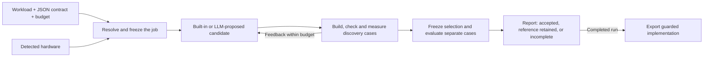

# Lossless

**Optimize ML computations under an explicit correctness contract.**

> An optimizer that combines formal reasoning, hardware information, and measured experiments to accelerate computations while preserving an explicit correctness contract.

Bring a supported workload, a JSON contract, and your own LLM. Lossless searches for faster implementations, checks them independently, and exports a guarded implementation with performance and correctness records. Built-in candidates let you try the workflow without an API key.

**Status: installable source alpha (`0.1.0a1`), MIT-licensed original code, public source repository.** The long-term scope includes GPU optimization for language models, vision, and linear algebra. The supported workloads below define what runs today; CUDA execution, arbitrary model import, and task-quality acceptance remain future work.


One recorded evaluation batch on the pinned Apple M2 setup, using the retained recipe. Bars show throughput normalized to stock serial MLX; timing labels show **median batch completion time**. It does not measure live-LLM search gains or establish performance on other models/devices. [Measurements and reproduction scope](lossless-product/docs/retention.md#readme-performance-figure) · [Source data](lossless-product/docs/assets/mlx-retention-evaluation.json).

## Quickstart

Requires **Python 3.10+ and clang** on macOS or Linux. On macOS, clang is provided by the Xcode Command Line Tools. Python dependencies install automatically; the CPU demo needs no model weights, GPU, LLM key, or proof toolchain.

```sh
git clone https://github.com/aarnav9/lossless-opt.git
cd lossless-opt
python3 -m venv .venv
source .venv/bin/activate
python -m pip install ./lossless-product

lossless doctor
lossless demo --budget 60s --output ./lossless-runs/demo
lossless report ./lossless-runs/demo
lossless export ./lossless-runs/demo --output ./lossless-runs/copy-artifact
```

The source repository is public. The package has not been published to PyPI or Homebrew. See the [product guide](lossless-product/README.md) for optional dependencies and Python usage.

The demo returns `accepted`, `reference_retained`, or `incomplete`, with `report.json` and `report.html` in the run directory. Completed runs export the accepted implementation or the reference; incomplete runs cannot be exported. A measured speedup is not guaranteed.

## How it works



The harness controls the reference, contract, evaluation, and acceptance decision. Your connected LLM receives relevant hardware facts, formal context, and discovery feedback. It proposes changes within the adapter's supported scope. Correctness requirements stay fixed throughout the search.

Optimization happens offline. Your application later loads the exported implementation; running it does not require the search LLM. Target and input guards determine where a replacement can run and when the reference is used.

## Supported today

| Adapter | Workload and target | Contract and scope |
| --- | --- | --- |
| `native.copy` | Float32 tensor copy; CPU | Exact bit patterns, including NaN payloads and signed zero |
| `native.softmax` | Row softmax; CPU | Fixed numerical tolerances against an independent float64 oracle |
| `native.rmsnorm_residual` | RMSNorm plus residual; CPU | Fixed numerical tolerances; unchanged precision |
| `mlx.fixed_count` | Complete fixed-count greedy inference requests; Apple M2 | Exact validation of tokens, emitted log probabilities, active KV state, and request order; pinned runtime and model artifact |

Native adapters currently use generated matrix inputs and accept C candidate source. The MLX adapter retains researched scheduling, dead-projection, cache-movement, and allocator optimizations. Its LLM proposal space currently selects allocator policies. MLX requires the pinned runtime and exact local model artifact described in the [alpha guide](lossless-product/docs/alpha.md#mlx-model-optimization); weights are not bundled.

The CPU suite and isolated package-install checks run on Linux and macOS. GPU validation currently covers the recorded M2 setup. [Retention and validation records](lossless-product/docs/retention.md) explain which research results were extracted, what was tested, and what remains outstanding.

## Configure a workload and connect your LLM

```sh
lossless init --template softmax --output ./my-job
lossless inspect ./my-job/lossless.json
lossless optimize ./my-job/lossless.json --output ./lossless-runs/softmax
```

All user configuration uses **JSON only**. Workload, contract, and budget live in one job file. The contract can instead reference a reusable JSON file. Hardware is detected automatically; an optional JSON hardware profile supplies context that is checked against the worker. Schema version `1` is executable; `draft-1` examples are design proposals.

Add an `llm` section to the generated job to use your model:

```json
{
  "llm": {
    "callback": "my_llm.py:complete",
    "provider": "your-provider",
    "model": "your-model",
    "credential_env": ["MY_MODEL_API_KEY"],
    "timeout_seconds": 120
  },
  "budget": {
    "wall_time_seconds": 180,
    "max_candidates": 4,
    "max_llm_calls": 1
  }
}
```

Merge those fields into the generated job, keeping its workload and contract. The total budget includes model calls, compilation, checks, and measurements; each call is also limited by the remaining budget. Built-in candidates count toward `max_candidates`.

Your `complete(prompt: str)` callback returns a proposal JSON string or object. A command alternative reads one JSON request from stdin and writes one proposal batch to stdout. The request contains the contract, reference code or recipe scope, hardware context, and discovery feedback; evaluation inputs are withheld from the prompt. Lossless checks and measures every admitted proposal independently. Keep API keys in environment variables. The `provider` and `model` fields are labels; the callback or command makes the actual model connection.

### Connect Claude or Codex

| Connection | Setup |
| --- | --- |
| Claude API | Install `anthropic` in the same virtual environment, set `ANTHROPIC_API_KEY`, and supply a Python callback using your chosen model. [Minimal callback and job configuration](lossless-product/docs/alpha.md#connecting-claude-or-codex). |
| Codex CLI | A user-supplied command wrapper invokes `codex exec` with a proposal JSON Schema and returns the final proposal object. It can reuse the CLI's saved authentication. [Official OpenAI documentation](https://learn.chatgpt.com/docs/non-interactive-mode). |
| Claude Code | A user-supplied command wrapper invokes `claude -p` with a proposal JSON Schema and extracts `structured_output` from its JSON response. [Official Claude Code documentation](https://code.claude.com/docs/en/headless). |

The callback/command interface is implemented. **Turnkey Claude/Codex connectors are not bundled, and a live-provider optimization run has not yet been validated.** A CLI wrapper must return proposal JSON rather than its tool's metadata or event stream. The [connection guide](lossless-product/docs/alpha.md#connecting-claude-or-codex) explains the boundary and current limitations.

### What the LLM tests establish

- The CPU suite uses a deterministic provider that returns the reference C implementation as a control candidate. It exercises prompt delivery, compilation, correctness checks, timing, separate evaluation, and export/load.
- The fresh-environment MLX test uses a deterministic provider proposing the 64 MiB allocator policy. The real harness evaluates it; the retained 256 MiB recipe wins that run.
- Regression tests cover malformed responses, timeouts, credential echoes, and withholding evaluation cases from proposal prompts.

A separate manual Codex-guided native study now compares authored candidates against retained recipes and enumeration; it is not a hosted-provider integration test. See the latest experiment ledger.

These are protocol and execution tests. They do not establish that Claude/Codex produces useful optimizations or that the measured retained-recipe speedup came from a live model call. [Validation record](lossless-product/docs/retention.md#local-verification-2-october-2026).

Capable reasoning models are a sensible starting point; measure their effect on gains and search cost. [Provider protocol and supported proposals](lossless-product/docs/alpha.md#provider-boundary).

## Correctness and formal reasoning

Research contributions can target three explicit contracts:

| Category | Requirement |
| --- | --- |
| Exact / lossless | Preserve the declared output bits, state, and behavior |
| Numerical | Stay within declared error bounds and invariants |
| Task quality | Meet a named metric and allowed change on a specified evaluation dataset |

These categories specify acceptable behavior. Relaxing a contract can admit more candidates, but does not guarantee a larger speedup. Comparing search outcomes requires the same workload, device, reference, and stated search effort.

The current runtime implements the exact and numerical contracts in the support table. Task quality is a research category pending an executable evaluator. A failed exact experiment can motivate a separate numerical or quality experiment; the existing job's contract never relaxes silently.

Bundled Lean proofs cover scoped structural transformations, and the theorem index supplies mathematical context. Lean/mathlib installation is optional and explicit. **Finite validation is not a universal proof of generated code or end-to-end floating-point equivalence.** Reports keep proof scope, validation evidence, and measured performance distinct. See [proof setup and scope](lossless-product/docs/alpha.md#optional-proof-setup).

## Tests and new architectures

The repository already includes [deterministic regression tests](lossless-product/tests), seeded native input generators, independent reference calculations, and separate discovery/evaluation inputs. Public regression cases provide reproducible checks; their presence in the repository does not make them a hidden evaluation set.

For CUDA and later backends, the planned approach combines reviewed contract tests and generators with LLM-proposed additional cases and setup code. Experiment findings can suggest cases such as irregular shapes, padding, or cache aliasing. The runner validates admitted cases, obtains expected results independently, and freezes acceptance criteria. New runtime-specific runners still require tests on their target hardware.

Automatic LLM test generation and backend bootstrapping are **not implemented** in the alpha. See the [proposed test workflow](CONTRIBUTING.md#llm-proposed-tests-and-new-backends) for the trust boundary, folder plan, and hardware qualification steps.

## Contribute an experiment

Ideas, reproductions, failed attempts, and negative results are welcome. Start with a hypothesis; you do not need a successful speedup or your own GPU. Read the [experiment ledger](EXPERIMENTS.md), then use the short [submission format](CONTRIBUTING.md#submit-an-idea-or-result).

Keep the ledger concise: one experiment line and one result line. Small reproduction scripts, generators, and fixtures supporting public claims belong in the tracked repository. Bulk runs, weights, and exploratory artifacts stay in the ignored research workspace.

The next milestone is a bounded PyTorch-on-CUDA workflow with a supported vision example, followed by a short external test on a contributor's NVIDIA GPU. Broader hardware comparisons and public performance rankings follow that first validation. [Contribution and validation plan](CONTRIBUTING.md#next-validation-milestone).

## Repository and license

```text
lossless-product/      Installable package, adapters, proofs, tests, examples and docs
EXPERIMENTS.md         Concise experiment/result memory
CONTRIBUTING.md        Experiment categories, test workflow and development setup
.github/workflows/    CPU checks and isolated package installation
research/             Local research archive; ignored by Git
```

The product runs independently of `research/`. Original code is [MIT licensed](LICENSE); imported components retain their [third-party notices](lossless-product/NOTICE). Package-registry distribution remains pending.

[Architecture and future design](lossless-product/docs/architecture.md) · [Implemented API and configuration](lossless-product/docs/alpha.md) · [Product installation and deployment](lossless-product/README.md)

The [032–038 follow-up report](lossless-product/docs/frontier-032-038.md) records the explicit acceptance comparator, bounded optional graph recipes, manual Codex search, all six frontier pilots, and measured payback.
