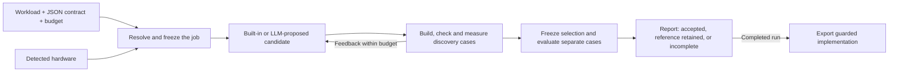

# Lossless

**Optimize ML computations under an explicit correctness contract.**

> An optimizer that combines formal reasoning, hardware information, and measured experiments to accelerate computations while preserving an explicit correctness contract.

Bring a supported workload, a JSON contract, and your own LLM. Lossless searches for faster implementations, checks them independently, and exports a guarded implementation with performance and correctness records. Built-in candidates let you try the workflow without an API key.

**Status: GitHub prerelease (`0.1.0a1`), MIT-licensed original code, public source repository.** The long-term scope includes GPU optimization for language models, vision, and linear algebra. The supported workloads below define what runs today; CUDA execution, arbitrary model import, and task-quality acceptance remain future work.


One recorded evaluation batch on the pinned Apple M2 setup, using the retained recipe. Bars show throughput normalized to stock serial MLX; timing labels show **median batch completion time**. It does not measure live-LLM search gains or establish performance on other models/devices. [Measurements and reproduction scope](lossless-product/docs/retention.md#readme-performance-figure) · [Source data](lossless-product/docs/assets/mlx-retention-evaluation.json).

## Quickstart

Requires **Python 3.10+ and clang** on macOS or Linux. On macOS, clang is provided by the Xcode Command Line Tools. Python dependencies install automatically; the CPU demo needs no model weights, GPU, LLM key, or proof toolchain.

```sh
python3 -m venv .venv
source .venv/bin/activate
python -m pip install https://github.com/aarnav9/lossless-opt/releases/download/v0.1.0a1/lossless_opt-0.1.0a1-py3-none-any.whl

lossless doctor
lossless demo --budget 60s --output ./lossless-runs/demo
lossless report ./lossless-runs/demo
lossless export ./lossless-runs/demo --output ./lossless-runs/copy-artifact
```

The [first GitHub prerelease](https://github.com/aarnav9/lossless-opt/releases/tag/v0.1.0a1) provides a wheel, source archive and checksums. For source development, clone this repository and install `./lossless-product`. The package has not been published to PyPI or Homebrew. See the [product guide](lossless-product/README.md) for optional dependencies and Python usage.

The demo returns `accepted`, `reference_retained`, or `incomplete`, with `report.json` and `report.html` in the run directory. Completed runs export the accepted implementation or the reference; incomplete runs cannot be exported. A measured speedup is not guaranteed.

## Profile before searching

Unreleased source now selects native candidates using complete public calls by
default, including guards, allocations and dispatch. Application searches also
gate regressions at each declared call position and can include startup costs.
[Benchmark policy and public suite choices](lossless-product/docs/benchmarking.md).

**Bring an existing application (current source):** `lossless init --project PATH --output .lossless/app`
detects the selected environment and generates setup with entry-point suggestions.
Supply representative cases and an invocation, inspect the readable preflight,
then use `lossless replay` to check reference repeatability in fresh workspaces.
This is the first stage of the [application workflow plan](lossless-product/docs/implementation.md#current-priority-bring-an-existing-application-5-october-2026);
callable profiling and optional Codex assessment are also available with
`lossless profile JOB --explain`. An opt-in
[`search-application` experiment](lossless-product/docs/application-search.md) can
now author scoped source changes and test complete callable speedups; guarded
application deployment remains under development.
[Intake guide](lossless-product/docs/applications.md) · [Profiling and model assessment](lossless-product/docs/application-profiling.md) · [Scoped ModPoly source experiment: 1.058× on repeated calls](lossless-product/docs/application-search-study.md).

```sh
lossless init --template softmax --output ./softmax-demo
lossless profile ./softmax-demo/lossless.json --budget 30s --output ./lossless-runs/profile
```

The HTML/JSON reports show first-call and warm timing, memory, separate host hotspots, and MLX latency/stages where applicable. Profiling uses discovery inputs and makes no LLM calls. Pass `--artifact PATH` to compare an exported implementation. [Profiling guide](lossless-product/docs/profiling.md) · [Release support matrix](lossless-product/docs/release-0.1.0a1.md).

Unreleased source adds frozen [MLX deployment limits](lossless-product/docs/alpha.md#mlx-deployment-limits-unreleased). [Broader qualification](lossless-product/docs/qualification-041-043.md) includes natural/code/multilingual workloads and a contract-checked stock batching control; the original roughly 2× gain is workload-specific. The published `v0.1.0a1` assets are unchanged.

## CPU application experiment

**Faster spectrum processing with exact tested outputs, on an Apple M2 CPU.**
Live GPT-6 Astra source search optimized polynomial setup and temporary-buffer
reuse in a spectrum-processing application built around pybaselines 1.2.1.
One frozen candidate was tested on eleven new workload profiles, with one
OpenBLAS thread on both sides:

| Comparison | Request speedup | Less request time |
| --- | ---: | ---: |
| Stock public calls | **1.757×** | **43.1%** |
| Stock reusable `Baseline` objects | **1.282×** | **22.0%** |
| Reusable objects + previous optimization | **1.152×** | **13.2%** |

Returned arrays, weights, coefficients and complete convergence histories matched
bit-for-bit; inputs and retained earlier outputs also matched. Both reusable-object
comparisons passed every speed, setup and memory gate. Against the strongest
baseline, traced allocation was equal or lower on every profile.

**This remains experimental.** The overall study retained the reference because
two profiles exceeded the separate allocation limits against public calls, largely
reflecting the existing reuse lifecycle. These are complete in-memory request
timings on a synthetic application around a real library; import/setup is measured
separately. They do not establish exactness or speedups for arbitrary code. Search
used two sessions with intervening feedback, so this is not a controlled timer
comparison. [Results, costs and model-free reproduction](lossless-product/docs/application-continuation-study.md)
· [Raw evidence](lossless-product/docs/evidence/application-continuation-pybaselines.json.gz)
· [Frozen source proposal](lossless-product/experiments/application_intake/continuation-candidate.json).

A later fixed-output comparison against **unmodified reusable pybaselines**
measured **1.289x request speedup (22.4% less time)** for the saved local output,
including ordinary CPU request overhead, with exactness/setup/memory/regression
checks passed on three new-seed profiles. The saved main output measured 1.091x
but failed its small-input regression gate. These are experimental program
outputs, not evidence that a new optimizer version is generally better.
Import/setup plus only four requests showed essentially no gain.
[Before/after protocol, results and reproduction](lossless-product/experiments/application_intake/README.md#final-optimized-program-versus-the-original-input).

## Search time is a performance tuning input

**More optimization time can help when a short cap prevents useful work from completing.** A larger allowance does not guarantee a faster result or weaken the correctness contract. Our timer study found a completion threshold, with no consistent gain from doubling a one-shot author allowance from 30 to 60 minutes.


Three independent authors per condition received the same **native numerical softmax** task, with announced 5-, 30- or 60-minute limits or an unannounced 60-minute control. All 27 returned proposals passed numerical checks. Direct 60/30-minute winner comparisons were 1.0023×, 1.0283× and 0.9954×; only one pair was faster across every final case. These are one-shot kernel results, separate from exact MLX inference and sustained iterative search. [Full results and payback](lossless-product/docs/timers-044.md) · [Source evidence](lossless-product/docs/assets/timers-044.json.gz) · [SVG](lossless-product/docs/assets/timers-044.svg) · [Earlier 5/30-minute study](lossless-product/docs/qualification-041-043.md#043-independent-model-authoring).

A [one-hour iterative follow-up](lossless-product/docs/iterate-045.md) added measured feedback between responses. Three rounds returned nine valid kernels; a fourth timed out. The final choice was only 1.00284× the first-round choice on fresh paired cases and failed the incremental improvement gate. Iterative search/evaluation took 59.20 minutes; enumeration took 97.92 seconds and delivered similar overall speed. This single trajectory does not establish that longer iterative search improves performance.

A [three-model pilot](lossless-product/docs/models-047.md) then gave Sol, Astra and Luna the same 30-minute ceiling and six call slots. None passed the incremental gate against the shared seed or enumeration. Astra had the highest paired mean; Luna reached similar speed to Sol in about half the search/evaluation time. The enumeration control took 61.07 seconds. One trajectory per model does not establish a general ranking.

A [broader MLX implementation experiment](lossless-product/docs/fullstack-048.md) allowed one author to revise scheduling, KV movement and graph execution. Six implementations passed discovery exactness; the selected source reached 1.098× the frozen strongest eligible references in two fresh held-out processes. It failed the full gate on long-single speed and one ragged first-token latency observation, so remains experimental. A sleep interruption also extended the nominal one-hour search beyond its wall-time allowance. This broader authoring interface is a research harness, not shipped product functionality.

A [20-task KernelBench-derived MLX pilot](lossless-product/docs/kernelbench-049.md) extends that research to operators, fusions and vision/MLP graphs. All tasks passed final numerical checks; max pooling (2.044×) and a convolution/pooling pipeline (1.585×) passed their full task speed gates. The full-suite gate failed despite a 1.149× held-out mean. These are M2-sized numerical experiments, not official KernelBench CUDA scores or shipped recipes.

Set both limits in the job: `budget.wall_time_seconds` controls the whole search; `llm.timeout_seconds` controls each LLM response (**default 30 minutes / 1,800 seconds in current source**). The source CLI also supports explicit overrides once a provider is configured:

```sh
lossless inspect ./my-job/lossless.json --budget 8h --llm-timeout 30m
set -o pipefail
python -u -m lossless optimize ./my-job/lossless.json --budget 8h --llm-timeout 30m --output ./lossless-runs/overnight 2>&1 | tee lossless-overnight.log
```

These are maximum allowances. Each response is also capped by remaining total search time after reserving evaluation time; a short job budget can cut it off before 30 minutes. Runs can finish early, and increasing total time alone does not increase candidate/call caps or the per-response limit. Leave time for compilation and final evaluation. The source CLI prints timestamped progress every 30 seconds during quiet waits. The resolved limits are frozen with the job before search. [JSON/Python configuration and current search limits](lossless-product/docs/alpha.md#search-time-and-performance-unreleased-cli-overrides).

## How it works



The harness controls the reference, contract, evaluation, and acceptance decision. Your connected LLM receives relevant hardware facts, formal context, and discovery feedback. It proposes changes within the adapter's supported scope. Correctness requirements stay fixed throughout the search.

Optimization happens offline. Your application later loads the exported implementation; running it does not require the search LLM. Target and input guards determine where a replacement can run and when the reference is used.

## Supported today

| Adapter | Workload and target | Contract and scope |
| --- | --- | --- |
| `native.copy` | Float32 tensor copy; CPU | Exact bit patterns, including NaN payloads and signed zero |
| `native.softmax` | Row softmax; CPU | Fixed numerical tolerances against an independent float64 oracle |
| `native.rmsnorm_residual` | RMSNorm plus residual; CPU | Fixed numerical tolerances; unchanged precision |
| `mlx.fixed_count` | Complete fixed-count greedy inference requests; Apple M2 | Exact validation of tokens, emitted log probabilities, active KV state, and request order; pinned runtime and model artifact |

Native adapters currently use generated matrix inputs and accept C candidate source. The MLX adapter retains researched scheduling, dead-projection, cache-movement, and allocator optimizations. Its LLM proposal space currently selects allocator policies. MLX requires the pinned runtime and exact local model artifact described in the [alpha guide](lossless-product/docs/alpha.md#mlx-model-optimization); weights are not bundled.

The CPU suite and isolated package-install checks run on Linux and macOS. GPU validation currently covers the recorded M2 setup. [Retention and validation records](lossless-product/docs/retention.md) explain which research results were extracted, what was tested, and what remains outstanding.

## Configure a workload and connect your LLM

```sh
lossless init --template softmax --output ./my-job
lossless inspect ./my-job/lossless.json
lossless optimize ./my-job/lossless.json --output ./lossless-runs/softmax
```

All user configuration uses **JSON only**. Workload, contract, and budget live in one job file. The contract can instead reference a reusable JSON file. Hardware is detected automatically; an optional JSON hardware profile supplies context that is checked against the worker. Schema version `1` is executable; `draft-1` examples are design proposals.

Add an `llm` section to the generated job to use your model:

```json
{
  "llm": {
    "callback": "my_llm.py:complete",
    "provider": "your-provider",
    "model": "your-model",
    "credential_env": ["MY_MODEL_API_KEY"],
    "timeout_seconds": 1800
  },
  "budget": {
    "wall_time_seconds": 3600,
    "max_candidates": 4,
    "max_llm_calls": 1
  }
}
```

Merge those fields into the generated job, keeping its workload and contract. The total budget includes model calls, compilation, checks, and measurements; each call is also limited by the remaining budget. Built-in candidates count toward `max_candidates`.

Your `complete(prompt: str)` callback returns a proposal JSON string or object. A command alternative reads one JSON request from stdin and writes one proposal batch to stdout. The request contains the contract, reference code or recipe scope, hardware context, and discovery feedback; evaluation inputs are withheld from the prompt. Lossless checks and measures every admitted proposal independently. Keep API keys in environment variables. The `provider` and `model` fields are labels; the callback or command makes the actual model connection.

### Connect Claude or Codex

| Connection | Setup |
| --- | --- |
| Claude API | Install `anthropic` in the same virtual environment, set `ANTHROPIC_API_KEY`, and supply a Python callback using your chosen model. [Minimal callback and job configuration](lossless-product/docs/alpha.md#connecting-claude-or-codex). |
| Codex CLI | Current source ships `python -m lossless.codex_provider`, using saved ChatGPT sign-in and structured proposals. [Ready-to-run job and subscription setup](lossless-product/docs/codex.md). |
| Claude Code | A user-supplied command wrapper invokes `claude -p` with a proposal JSON Schema and extracts `structured_output` from its JSON response. [Official Claude Code documentation](https://code.claude.com/docs/en/headless). |

The callback/command interface is implemented. **The Codex connector is available in current source, outside the published `v0.1.0a1` wheel.** Claude transports remain user-supplied. Codex uses your subscription allowance; API billing is separate. A live copy smoke verified the command path, evaluation and export/load, correctly retaining NumPy when the proposal did not win. [Setup, tested CLI version and costs](lossless-product/docs/codex.md) · [General connection guide](lossless-product/docs/alpha.md#connecting-claude-or-codex).

### What the LLM tests establish

- The CPU suite uses a deterministic provider that returns the reference C implementation as a control candidate. It exercises prompt delivery, compilation, correctness checks, timing, separate evaluation, and export/load.
- The fresh-environment MLX test uses a deterministic provider proposing the 64 MiB allocator policy. The real harness evaluates it; the retained 256 MiB recipe wins that run.
- Regression tests cover malformed responses, timeouts, credential echoes, and withholding evaluation cases from proposal prompts.
- The source Codex connector has a live ChatGPT-signed-in native-copy smoke; it returned an eligible proposal in 37.55 seconds and exported the retained reference. Model access probes passed for GPT-6.1 Sol, GPT-6 Astra and GPT-6 Luna.

A separate manual Codex-guided native study compared authored candidates against retained recipes and enumeration. [Campaign 043](lossless-product/docs/qualification-041-043.md#043-independent-model-authoring) adds independent live Codex CLI sessions; it tests model proposals through the native experiment harness, not a shipped vendor connector.

For a useful workload without model authoring, the [opt-in Fortran softmax recipe](lossless-product/examples/softmax-fortran/README.md) revalidates a frozen kernel locally and exports guards for 19 specific shapes. [Campaign 046](lossless-product/docs/softmax-046.md) qualified it across distributions and fresh processes, including ordinary application calls. It is a numerical CPU recipe; the broader default recipes remain unchanged.

The fixture tests establish protocol and execution behavior, not live-model proposal quality. The measured MLX retained-recipe speedup did not come from a live model call. [Validation record](lossless-product/docs/retention.md#local-verification-2-october-2026).

Capable reasoning models are a sensible starting point; measure their effect on gains and search cost. [Provider protocol and supported proposals](lossless-product/docs/alpha.md#provider-boundary).

## Correctness and formal reasoning

Research contributions can target three explicit contracts:

| Category | Requirement |
| --- | --- |
| Exact / lossless | Preserve the declared output bits, state, and behavior |
| Numerical | Stay within declared error bounds and invariants |
| Task quality | Meet a named metric and allowed change on a specified evaluation dataset |

These categories specify acceptable behavior. Relaxing a contract can admit more candidates, but does not guarantee a larger speedup. Comparing search outcomes requires the same workload, device, reference, and stated search effort.

The current runtime implements the exact and numerical contracts in the support table. Task quality is a research category pending an executable evaluator. A failed exact experiment can motivate a separate numerical or quality experiment; the existing job's contract never relaxes silently.

Bundled Lean proofs cover scoped structural transformations, and the theorem index supplies mathematical context. Lean/mathlib installation is optional and explicit. **Finite validation is not a universal proof of generated code or end-to-end floating-point equivalence.** Reports keep proof scope, validation evidence, and measured performance distinct. See [proof setup and scope](lossless-product/docs/alpha.md#optional-proof-setup).

## Tests and new architectures

The repository already includes [deterministic regression tests](lossless-product/tests), seeded native input generators, independent reference calculations, and separate discovery/evaluation inputs. Public regression cases provide reproducible checks; their presence in the repository does not make them a hidden evaluation set.

For CUDA and later backends, the planned approach combines reviewed contract tests and generators with LLM-proposed additional cases and setup code. Experiment findings can suggest cases such as irregular shapes, padding, or cache aliasing. The runner validates admitted cases, obtains expected results independently, and freezes acceptance criteria. New runtime-specific runners still require tests on their target hardware.

Automatic LLM test generation and backend bootstrapping are **not implemented** in the alpha. See the [proposed test workflow](CONTRIBUTING.md#llm-proposed-tests-and-new-backends) for the trust boundary, folder plan, and hardware qualification steps.

## Contribute an experiment

Ideas, reproductions, failed attempts, and negative results are welcome. Start with a hypothesis; you do not need a successful speedup or your own GPU. Read the [experiment ledger](EXPERIMENTS.md), then use the short [submission format](CONTRIBUTING.md#submit-an-idea-or-result).

Keep the ledger concise: one experiment line and one result line. Small reproduction scripts, generators, and fixtures supporting public claims belong in the tracked repository. Bulk runs, weights, and exploratory artifacts stay in the ignored research workspace.

The next milestone is a bounded PyTorch-on-CUDA workflow with a supported vision example, followed by a short external test on a contributor's NVIDIA GPU. Broader hardware comparisons and public performance rankings follow that first validation. [Contribution and validation plan](CONTRIBUTING.md#next-validation-milestone).

## Repository and license

```text
lossless-product/      Installable package, adapters, proofs, tests, examples and docs
EXPERIMENTS.md         Concise experiment/result memory
CONTRIBUTING.md        Experiment categories, test workflow and development setup
.github/workflows/    CPU checks and isolated package installation
research/             Local research archive; ignored by Git
```

The product runs independently of `research/`. Original code is [MIT licensed](LICENSE); imported components retain their [third-party notices](lossless-product/NOTICE). Package-registry distribution remains pending.

[Architecture and future design](lossless-product/docs/architecture.md) · [Implemented API and configuration](lossless-product/docs/alpha.md) · [Product installation and deployment](lossless-product/README.md)

The [032–038 follow-up report](lossless-product/docs/frontier-032-038.md) records the explicit acceptance comparator, bounded optional graph recipes, manual Codex search, all six frontier pilots, and measured payback.
