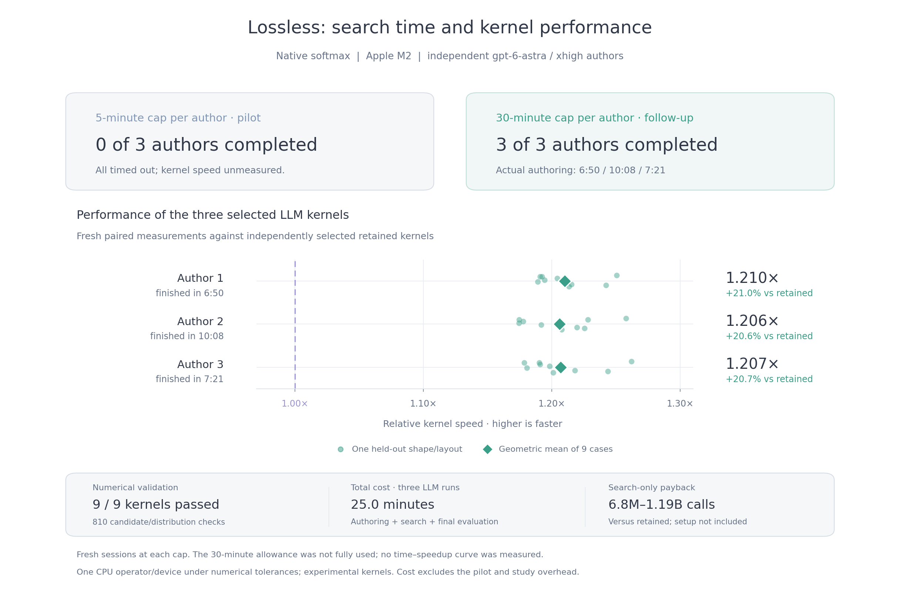

# Lossless

> An optimizer that combines formal reasoning, hardware information, and measured experiments to accelerate computations while preserving an explicit correctness contract.

**GitHub prerelease, `0.1.0a1`.** Lossless searches offline, checks candidates against a frozen contract, measures them on separate discovery and evaluation cases, and exports a guarded implementation. If no candidate qualifies, it retains the reference. Connect your own reasoning LLM through a Python callback or JSON command; retained candidates also work without an API key.

The product direction covers ML, vision, and linear algebra. This alpha implements the adapters below. It does not yet optimize arbitrary model graphs or CUDA workloads.

| Adapter | Computation | Correctness and limits |
| --- | --- | --- |
| `native.copy` | Float32 tensor copy on CPU | Exact bit patterns, including NaN payloads and signed zero; finite validation |
| `native.softmax` | Row softmax on CPU | Explicit numerical tolerances against an independent float64 oracle |
| `native.rmsnorm_residual` | RMSNorm plus residual on CPU | Explicit numerical tolerances; unchanged precision |
| `mlx.fixed_count` | Complete fixed-count greedy inference requests | Retained exact scheduling, dead terminal projections, cache movement, and allocator policy; pinned Apple M2 / MLX / model artifact |

## Install and run

Python 3.10+ and clang are needed for the CPU adapters. On macOS, clang comes with the Xcode Command Line Tools; on Linux, install your distribution's clang package. Python dependencies install automatically. Python 3.11 is the tested MLX environment.

From the repository root:

```sh
python3 -m venv .venv
source .venv/bin/activate
python -m pip install ./lossless-product
lossless doctor
lossless demo --budget 60s --output ./lossless-runs/demo
lossless export ./lossless-runs/demo --output ./lossless-runs/copy-artifact
```

From a standalone copy of this folder, use `python -m pip install .`. This source alpha is not published to PyPI or Homebrew. NumPy is the only required Python dependency. Optional extras install SciPy baselines (`.[numerical]`) or the pinned Apple Silicon runtime (`.[mlx]`). Model weights and proof toolchains are separate.

Use the exported operation without an LLM:

```python
import numpy as np
import lossless

operation = lossless.load("lossless-runs/copy-artifact")
x = np.arange(64 * 257, dtype=np.float32).reshape(64, 257)
y = operation(x)

# Bind buffers once to use the interface measured by the native harness.
bound = operation.bind(x)
y = bound()
```

New source native jobs default to `objective.timing_scope: "call"`: acceptance measures ordinary `operation(x)` calls, including guards, allocation, binding and dispatch. Kernel-only timings are diagnostic. Select `"bound"` explicitly only when the application reuses bound buffers; that boundary excludes binding and allocation. Historical results retain their original measurement scope. A bound result is overwritten on its next call. Preserve the bound arrays' dtype, shape, strides, and value-domain contract; use separate bindings for separate workers. Unseen shapes/layouts or changed environments use the reference. Artifact hashes detect changed files; they are not signatures. Load artifacts you trust. [Benchmark boundaries, regression gates and public suite choices](docs/benchmarking.md).

## Configure a job and your LLM

For an existing local application, current source also supports
`lossless init --project PATH --output .lossless/app`, readable `lossless inspect`,
and explicit `lossless replay` with a function/model factory or command and
representative inputs. This generates configuration and checks reference
repeatability without model calls. `lossless profile JOB --explain` adds callable
profiling and an optional evidence-linked Codex assessment. The experimental
[`search-application` loop](docs/application-search.md) authors scoped source
changes, checks exact observations and measures complete callable speedups.
Guarded application deployment remains under development.
[ModPoly experiment: 1.058× on scoped repeated calls](docs/application-search-study.md).
[Profiling guide](docs/application-profiling.md) · [Intake guide](docs/applications.md) · [Example](examples/application/README.md)
· [Eight-part product plan](docs/implementation.md#current-priority-bring-an-existing-application-5-october-2026).

```sh
lossless init --template softmax --output ./my-job
lossless inspect ./my-job/lossless.json
lossless optimize ./my-job/lossless.json --output ./lossless-runs/softmax
```

Templates are `copy`, `softmax`, `rmsnorm`, and `mlx-fixed-count`. Configuration files accept JSON only. JSON schema version `1` is executable; the earlier `draft-1` examples are design proposals. [The alpha guide](docs/alpha.md) covers contracts, hardware inputs, providers, reports, and MLX deployment.

Add an `llm` object to the job:

```json
{
  "llm": {
    "callback": "my_llm.py:complete",
    "provider": "your-provider",
    "model": "your-model",
    "credential_env": ["MY_MODEL_API_KEY"],
    "timeout_seconds": 1800
  },
  "budget": {
    "wall_time_seconds": 3600,
    "max_candidates": 4,
    "max_llm_calls": 1
  }
}
```

Merge those fields into the generated job while keeping its workload and contract. The total budget includes provider time and evaluation; built-in candidates count toward the candidate limit.

**Search time is a performance tuning input. More time is likely to help when reasoning or evaluation is the bottleneck, but faster results are not guaranteed.** In campaign 043, five-minute authors timed out; a 30-minute cap allowed fresh authors to finish in roughly 7–10 minutes and produce kernels 20.6–21.0% faster than retained on held-out numerical softmax cases. This does not establish a continuous time/speedup relationship or an end-to-end model gain.



Dots show nine held-out case speedups per selected kernel; diamonds show geometric means. Five-minute kernel speed is unmeasured. [Figure data and interpretation](docs/qualification-041-043.md#readme-search-time-figure) · [SVG](docs/assets/search-time-043.svg).

The unreleased source defaults to **30 minutes per LLM response** when `llm.timeout_seconds` is omitted. Set that JSON field or use `--llm-timeout 1h` to change it. `lossless inspect ./my-job/lossless.json --budget 8h --llm-timeout 30m` previews the frozen job; use the same options with `lossless optimize` to run it. Each response is capped by remaining total search time after reserving evaluation time, so a short job budget can cut it off earlier. Candidate/call caps still apply, and runs can finish early. [JSON/Python configuration](docs/alpha.md#search-time-and-performance-unreleased-cli-overrides) · [Expanded timer study and payback](docs/timers-044.md).

Your `complete(prompt: str)` calls your preferred model and returns the JSON proposal string or object. The prompt contains the response schema, contract, permitted transformations, hardware context, and discovery feedback. A command alternative accepts one JSON request on stdin and emits one proposal batch on stdout. No model SDK or hosted Lossless service is required. Prefer a capable reasoning model for difficult searches; improved gains are a hypothesis to measure, not a guarantee. Native adapters accept C candidates; MLX currently lets the LLM choose among retained allocator policies rather than generating arbitrary GPU programs.

The [Codex subscription guide](docs/codex.md) provides a ready-to-run JSON job and the bundled source command `python -m lossless.codex_provider`, which uses saved ChatGPT sign-in. The [general connection guide](docs/alpha.md#connecting-claude-or-codex) includes a minimal Claude API callback and the Claude Code command boundary. Provider/model labels alone do not select a service; the callback or command performs the call. The Codex connector is not in the published `v0.1.0a1` wheel.

**Automated provider tests use deterministic local providers.** The CPU control submits reference C code; the installed MLX test proposes a retained allocator policy. Current source also passed a live ChatGPT-signed-in Codex native-copy smoke through the shipped command connector, including evaluation and export/load; NumPy was retained when the candidate did not win. [Connector validation](docs/codex.md#what-was-actually-checked) · [Earlier independent authoring study](docs/qualification-041-043.md#043-independent-model-authoring) · [Validation record](docs/retention.md).

The [opt-in Fortran softmax recipe](examples/softmax-fortran/README.md) needs no authoring model. It revalidates the frozen campaign-046 source locally and exports exact shape/layout guards and reference fallback. [Qualification, ordinary-call timings and limits](docs/softmax-046.md).

[Campaign 048](docs/fullstack-048.md) tested broader authoring across MLX scheduling, KV movement and graph execution. Its selected implementation averaged 1.098× the frozen strongest eligible references in fresh held-out processes but failed the full speed/latency gate. It remains a research implementation; the product MLX proposal interface is unchanged.

[Campaign 049](docs/kernelbench-049.md) adds a 20-task KernelBench-derived MLX research suite. Two tasks passed their full speed gates, with all tasks passing final numerical checks. The full-suite gate failed; these are experimental ports and generated implementations, not a generic product adapter.

## Recorded product measurement


This is a warm batch measurement of the retained recipe on a pinned model/runtime/device. It does not measure live-LLM search gains. [Source data and reproduction scope](docs/retention.md#readme-performance-figure).

## Recorded CPU application experiment

Live Astra source search on a pybaselines spectrum-processing application produced
**1.282× request speed over stock reusable objects** and **1.152× over reusable
objects plus the previous optimization** on eleven new Apple M2 CPU profiles.
Speedup over stock public calls was 1.757×. All comparisons used one OpenBLAS thread;
returned arrays, weights, coefficients and complete convergence histories matched
bit-for-bit, including input and retained-output checks.

Both reusable-object comparisons passed every speed, setup and memory gate. The
strongest-baseline comparison used equal or less traced allocation in every case.
The overall study still retained the reference: two public-call allocation limits
failed, largely reflecting the existing reuse lifecycle. This is experimental
evidence for complete in-memory requests in a synthetic application around a real
library; import/setup is measured separately. Guarded application deployment and
exactness on arbitrary inputs remain outside this result.
[Full results, search cost and model-free reproduction](docs/application-continuation-study.md)
· [Raw evidence](docs/evidence/application-continuation-pybaselines.json.gz).

## Formal reasoning and dependencies

The compressed theorem index ships with the package. Searching it requires no Lean installation:

```sh
lossless proofs search "matrix transpose"
```

Install the proof tools explicitly when needed:

```sh
python -u -m lossless setup --proofs lean
lossless proofs check
# Optional mathlib project, with pinned toolchain and dependency revisions:
python -u -m lossless setup --proofs mathlib
```

Setup can download several GiB and take several minutes. The seven retained transformation proof modules require Lean/Std; mathlib supports the broader matrix and linear-algebra library. `"proofs": {"check": true}` requires successful scoped checks for the job. A numerical or exact contract still has **finite validation** evidence: Lean checks here do not prove generated C, floating-point GPU arithmetic, or end-to-end model equivalence. Unsupported `required_evidence: "proved"` requests are rejected.

## Tests and proposed backend support

The current test suite covers strict contracts, seeded workloads, compiler failures, invalid candidates, export/load, and reference fallback. Discovery and evaluation cases are separate. See the repository's [test and contribution workflow](https://github.com/aarnav9/lossless-opt/blob/main/CONTRIBUTING.md#llm-proposed-tests-and-new-backends) for the proposed combination of versioned regression cases, reviewed generators, and LLM-suggested tests.

Automatic test generation and CUDA backend setup are planned extensions. Generated tests cannot change a running job's contract, independent reference, or acceptance criteria. Future hardware adapters need validation on their target device before support is claimed.

## Development

From this folder:

```sh
python -m pip install -e '.[dev]'
python -m unittest discover -s tests -v
python -m build
```

Candidate execution and provider callbacks use trusted local processes with timeouts, not an OS security sandbox. Run with representative inputs you are allowed to send to your configured provider. Evaluation data is withheld from proposal prompts; candidates do not decide acceptance.

See [retention and release validation](docs/retention.md), [third-party notices](NOTICE), and the repository's experiment ledger. Original code is [MIT licensed](LICENSE); third-party components retain their own licenses. The [GitHub prerelease](https://github.com/aarnav9/lossless-opt/releases/tag/v0.1.0a1) includes wheels, source and checksums; package-registry distribution remains pending. Design documents describe the broader target architecture; this README and the alpha guide define implemented behavior.

Use `lossless profile JOB --output DIRECTORY` to measure discovery inputs without searching or calling a provider. Add `--artifact PATH` to compare a guarded deployment. [Profiling guide](docs/profiling.md) · [Release installation and support matrix](docs/release-0.1.0a1.md) · [Expanded softmax qualification](docs/softmax-039.md).

The unreleased source also supports frozen [MLX deployment limits](docs/alpha.md#mlx-deployment-limits-unreleased) for latency, active allocation, throughput and payback. [Broader workload qualification](docs/qualification-041-043.md) records where batching gains repeat and where they do not; these additions are not in the immutable `v0.1.0a1` release assets.
