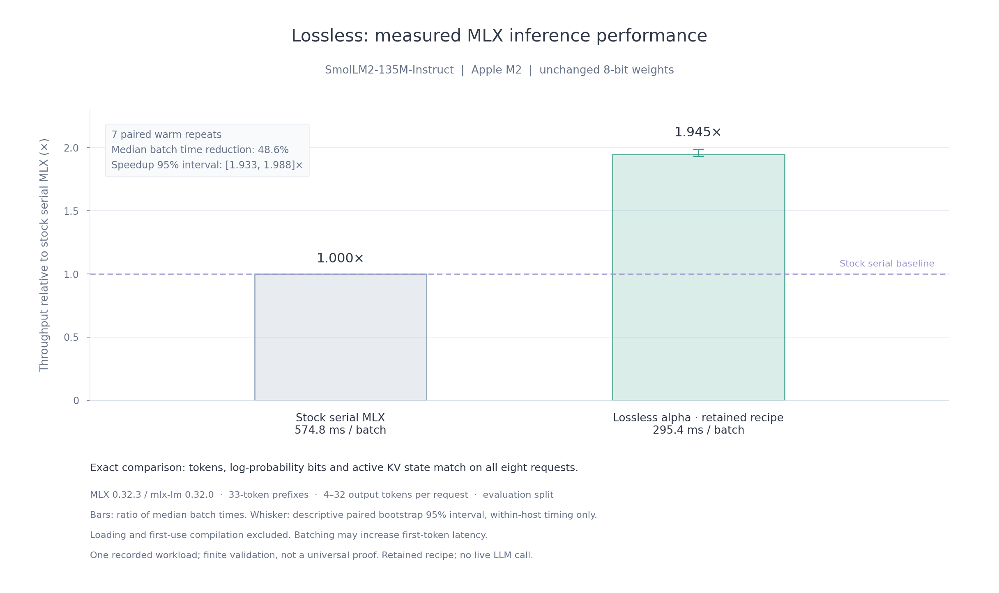

# Lossless

> An optimizer that combines formal reasoning, hardware information, and measured experiments to accelerate computations while preserving an explicit correctness contract.

**Installable source alpha, `0.1.0a1`.** Lossless searches offline, checks candidates against a frozen contract, measures them on separate discovery and evaluation cases, and exports a guarded implementation. If no candidate qualifies, it retains the reference. Connect your own reasoning LLM through a Python callback or JSON command; retained candidates also work without an API key.

The product direction covers ML, vision, and linear algebra. This alpha implements the adapters below. It does not yet optimize arbitrary model graphs or CUDA workloads.

| Adapter | Computation | Correctness and limits |
| --- | --- | --- |
| `native.copy` | Float32 tensor copy on CPU | Exact bit patterns, including NaN payloads and signed zero; finite validation |
| `native.softmax` | Row softmax on CPU | Explicit numerical tolerances against an independent float64 oracle |
| `native.rmsnorm_residual` | RMSNorm plus residual on CPU | Explicit numerical tolerances; unchanged precision |
| `mlx.fixed_count` | Complete fixed-count greedy inference requests | Retained exact scheduling, dead terminal projections, cache movement, and allocator policy; pinned Apple M2 / MLX / model artifact |

## Install and run

Python 3.10+ and clang are needed for the CPU adapters. On macOS, clang comes with the Xcode Command Line Tools; on Linux, install your distribution's clang package. Python dependencies install automatically. Python 3.11 is the tested MLX environment.

From the repository root:

```sh
python3 -m venv .venv
source .venv/bin/activate
python -m pip install ./lossless-product
lossless doctor
lossless demo --budget 60s --output ./lossless-runs/demo
lossless export ./lossless-runs/demo --output ./lossless-runs/copy-artifact
```

From a standalone copy of this folder, use `python -m pip install .`. This source alpha is not published to PyPI or Homebrew. NumPy is the only required Python dependency. Optional extras install SciPy baselines (`.[numerical]`) or the pinned Apple Silicon runtime (`.[mlx]`). Model weights and proof toolchains are separate.

Use the exported operation without an LLM:

```python
import numpy as np
import lossless

operation = lossless.load("lossless-runs/copy-artifact")
x = np.arange(64 * 257, dtype=np.float32).reshape(64, 257)
y = operation(x)

# Bind buffers once to use the interface measured by the native harness.
bound = operation.bind(x)
y = bound()
```

The native harness measures calls with preallocated buffers, including ctypes dispatch. `operation(x)` also allocates and validates; those additional costs are not included in the reported native speedup. A bound result is overwritten on its next call. Preserve the bound arrays' dtype, shape, strides, and value-domain contract; use separate bindings for separate workers. Unseen shapes/layouts or changed environments use the reference. Artifact hashes detect changed files; they are not signatures. Load artifacts you trust.

## Configure a job and your LLM

```sh
lossless init --template softmax --output ./my-job
lossless inspect ./my-job/lossless.json
lossless optimize ./my-job/lossless.json --output ./lossless-runs/softmax
```

Templates are `copy`, `softmax`, `rmsnorm`, and `mlx-fixed-count`. Configuration files accept JSON only. JSON schema version `1` is executable; the earlier `draft-1` examples are design proposals. [The alpha guide](docs/alpha.md) covers contracts, hardware inputs, providers, reports, and MLX deployment.

Add an `llm` object to the job:

```json
{
  "llm": {
    "callback": "my_llm.py:complete",
    "provider": "your-provider",
    "model": "your-model",
    "credential_env": ["MY_MODEL_API_KEY"],
    "timeout_seconds": 120
  },
  "budget": {
    "wall_time_seconds": 180,
    "max_candidates": 4,
    "max_llm_calls": 1
  }
}
```

Merge those fields into the generated job while keeping its workload and contract. The total budget includes provider time and evaluation; built-in candidates count toward the candidate limit.

Your `complete(prompt: str)` calls your preferred model and returns the JSON proposal string or object. The prompt contains the response schema, contract, permitted transformations, hardware context, and discovery feedback. A command alternative accepts one JSON request on stdin and emits one proposal batch on stdout. No model SDK or hosted Lossless service is required. Prefer a capable reasoning model for difficult searches; improved gains are a hypothesis to measure, not a guarantee. Native adapters accept C candidates; MLX currently lets the LLM choose among retained allocator policies rather than generating arbitrary GPU programs.

The [Claude/Codex connection guide](docs/alpha.md#connecting-claude-or-codex) includes a minimal Claude API callback and explains command wrappers for Codex CLI and Claude Code. Provider/model labels alone do not connect a service; your callback or command performs the call. Turnkey vendor connectors are not bundled.

**Provider integration tests use deterministic local providers; a separate manual Codex-guided native search study is recorded in the experiment ledger. Hosted Claude/OpenAI integration remains unvalidated.** The CPU control submits reference C code; the installed MLX test proposes a retained allocator policy. These tests exercise the real harness, including failed responses and separate evaluation. They establish protocol behavior, not live-model optimization quality. See the [validation record](docs/retention.md).

## Recorded product measurement



This is a warm batch measurement of the retained recipe on a pinned model/runtime/device. It does not measure live-LLM search gains. [Source data and reproduction scope](docs/retention.md#readme-performance-figure).

## Formal reasoning and dependencies

The compressed theorem index ships with the package. Searching it requires no Lean installation:

```sh
lossless proofs search "matrix transpose"
```

Install the proof tools explicitly when needed:

```sh
python -u -m lossless setup --proofs lean
lossless proofs check
# Optional mathlib project, with pinned toolchain and dependency revisions:
python -u -m lossless setup --proofs mathlib
```

Setup can download several GiB and take several minutes. The seven retained transformation proof modules require Lean/Std; mathlib supports the broader matrix and linear-algebra library. `"proofs": {"check": true}` requires successful scoped checks for the job. A numerical or exact contract still has **finite validation** evidence: Lean checks here do not prove generated C, floating-point GPU arithmetic, or end-to-end model equivalence. Unsupported `required_evidence: "proved"` requests are rejected.

## Tests and proposed backend support

The current test suite covers strict contracts, seeded workloads, compiler failures, invalid candidates, export/load, and reference fallback. Discovery and evaluation cases are separate. See the repository's [test and contribution workflow](https://github.com/aarnav9/lossless-opt/blob/main/CONTRIBUTING.md#llm-proposed-tests-and-new-backends) for the proposed combination of versioned regression cases, reviewed generators, and LLM-suggested tests.

Automatic test generation and CUDA backend setup are planned extensions. Generated tests cannot change a running job's contract, independent reference, or acceptance criteria. Future hardware adapters need validation on their target device before support is claimed.

## Development

From this folder:

```sh
python -m pip install -e '.[dev]'
python -m unittest discover -s tests -v
python -m build
```

Candidate execution and provider callbacks use trusted local processes with timeouts, not an OS security sandbox. Run with representative inputs you are allowed to send to your configured provider. Evaluation data is withheld from proposal prompts; candidates do not decide acceptance.

See [retention and release validation](docs/retention.md), [third-party notices](NOTICE), and the repository's experiment ledger. Original code is [MIT licensed](LICENSE); third-party components retain their own licenses. Tagged releases and package-registry distribution remain pending. Design documents describe the broader target architecture; this README and the alpha guide define implemented behavior.
