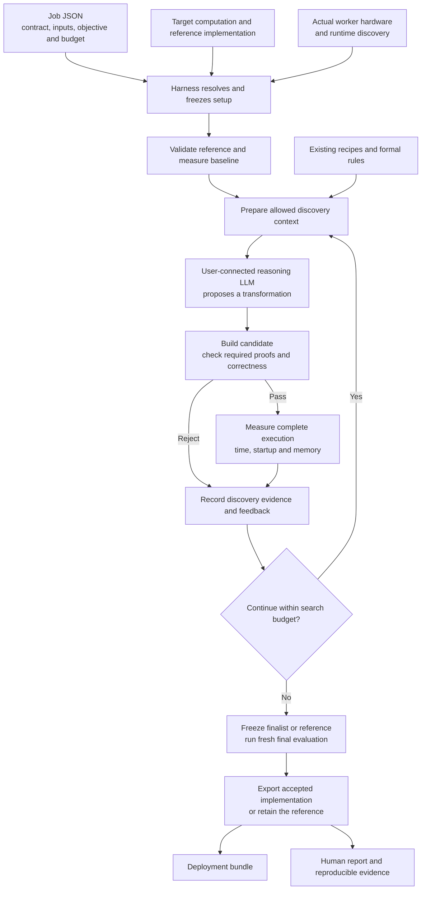
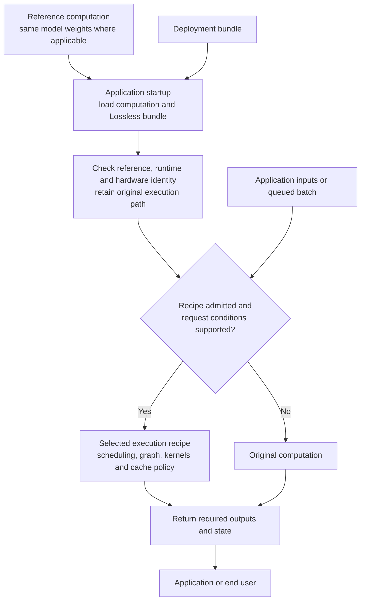
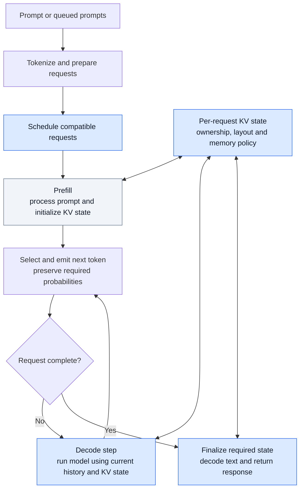

# Lossless architecture and computation lifecycle

Lossless optimizes how a computation executes under a specified correctness contract. For model inference, it produces a reusable execution recipe and implementation for the same reference model, with measured evidence and compatibility guards. The product architecture below is proposed; the current research already supplies several scoped recipes, proofs, and measurements, while clean packaging and deployment integration remain to be built.

The target computation may be a vision model, language model, tensor subgraph, or numerical routine. The **user-connected reasoning LLM** proposes optimizations during tuning, including for computations that contain no language model. The shared core handles inputs, outputs, optional state, contracts, and evidence; domain adapters supply the meaning of those values. See the [scope and workload examples](design.md#product-scope-ml-and-numerical-computation).

## Optimization before deployment

The application developer runs a bounded optimization job on the intended execution hardware, typically before deployment. They can repeat it explicitly when the model, runtime, hardware, or workload changes. Existing compatible recipes are candidates too; every user should not have to rediscover the same improvements.



The harness owns the contract and evaluator. Candidate-generated code and claims cannot change them. Required proof obligations are checked with their exact scope recorded; finite numerical tests and scoped structural proofs are separate evidence. A reference failure stops the job. A candidate failure becomes discovery feedback. Final evaluation is withheld from further tuning for that job, and insufficient confirmation keeps the reference.

This workflow does not require an additional internal LLM. A recipes-only mode can use the same harness without model calls; user-connected model-driven search is a core product path.

## What the optimization job outputs

| Output | Contents | Who uses it |
| --- | --- | --- |
| Deployment manifest | Reference/model identity, contract, compatible runtime/hardware, dependencies, supported input conditions | Loader and runtime guards |
| Selected implementation | Scheduling/cache policy, rewritten graph, generated source, or compatible compiled kernels as supported by the adapter | Application's computation path |
| Reference binding | How to load or invoke the preserved original implementation | Fallback and comparison |
| Correctness evidence | Test coverage/results, state/continuation checks, scoped proof receipts and assumptions | Developer and artifact admission checks |
| Performance report | Original versus selected implementation; startup, warmed latency/throughput, memory, uncertainty, tuning cost and expected payback | Developer deciding whether to deploy |
| Run record | Resolved configuration, identities, proposals, failures, raw measurements and decisions | Reproduction, diagnosis and resume |

Illustrative packaging:

```text
run/
  resolved.json
  hardware.json
  report.html
  evidence/
  deployment/
    manifest.json
    recipe.json
    implementation/
```

These names are proposed, not existing generated outputs. The deployable subset references the necessary evidence and original computation. Model-based jobs also bind the model identity; weights remain unchanged for the exact recipes and need not be copied into the bundle. A matrix routine need not have any weights or tokenizer. MLX artifacts may still require the supported MLX/Python environment; a native CPU artifact may expose a compiled ABI. A portable recipe is not automatically a portable binary.

An optimized implementation is not required when the search finds no qualifying improvement. The report should explain why the reference was retained. An artifact is bound to a reference/runtime/hardware/contract combination and input conditions, including model identity where applicable.

## Where it enters the user application

At application startup, the developer loads the reference computation and selected deployment bundle, including the same model weights for model-based jobs. Reference, artifact and environment identities are checked once at admission. Cheap input/session guards decide whether the selected recipe applies before optimized execution begins. A vision application supplies images and receives its declared predictions; a numerical application supplies arrays and receives results through the supported adapter.



The deployment path performs no optimizer LLM calls, proof search, or automatic retuning. It does not time the original alongside every ordinary request. Correctness testing and comparative benchmarking happen during optimization/admission; guards enforce the declared applicability conditions at runtime. Finite validation plus guards remains finite evidence, not a universal proof of equivalence.

For stateful execution, choose a supported path before mutating session state. An error after state mutation cannot trigger a transparent retry unless the adapter can restore or safely translate that state. Changed weights/runtime require invalidation and re-admission. Streaming, concurrent requests, cancellation, and EOS behavior need explicit adapter support; the current optimized MLX research path is fixed-count, single-worker bulk execution, with unsupported stopping/cancellation using the reference path.

## Case study: language-model execution

For an autoregressive language model, prompt processing prepares the initial model state. Subsequent decode steps repeatedly run the model to produce another token. A request scheduler can group work from several requests while each request retains its own token history and state.



This is a logical inference diagram; backend pipeline ordering and final state advances still follow the reference contract. Blue boxes mark places relevant to retained research recipes, not a claim that every box has an independently measured speedup. Prefill is shown for context: accelerating decode or scheduling does not establish faster prefill.

| Part of execution | How Lossless can change it | Connection to the research |
| --- | --- | --- |
| Scheduling | Regroup independent compatible requests to reduce repeated model invocations | Exact cohort scheduling and restricted batching |
| Model computation | Reuse compiled graphs, select eligible kernels, reduce host dispatch | Qualified exact graph-capture recipes and earlier exact MPS work |
| KV state handling | Avoid unnecessary metadata work and copies, manage ownership/layout | Exact cache and short-cache movement recipes |
| Finalization | Skip genuinely unobserved projection work while retaining required state updates | Lean-guided terminal-projection elimination |
| Allocation | Retain useful buffers within memory limits | Accepted allocator-cache policy |

These are reusable transformations of the execution path. They are not tied to a particular output word or a saved answer for one prompt. A new prompt within the declared applicability conditions can use the recipe, though current correctness evidence is finite. Shape, sequence length, request mix, stopping policy, model identity, and runtime can still determine which recipe is eligible and whether it is faster.

For this integration, the accurate claim is **faster execution of the same reference model on supported workloads while enforcing the declared contract**. For the current exact recipes, the weights stay the same. Performance can improve because scheduling and memory overhead fall even when the arithmetic performed by an individual layer stays unchanged.

Measure several distinct outcomes: prompt-processing time, time to first token, decode time per token, total request time, and aggregate throughput. A faster kernel is useful only if it helps the intended objective after integration overhead. Higher bulk throughput does not imply equally faster single-user responses.

## Applications and current readiness

| Use case | Where Lossless fits | Current evidence and remaining work |
| --- | --- | --- |
| Vision inference: classification, detection, segmentation | Tune a supported model or subgraph for representative image shapes/batches, then load the artifact in the application | Intended domain; needs adapter coverage, output observers, and measured end-to-end evidence |
| Numerical or scientific application | Tune an expensive tensor function or structured solve, then reuse the callable artifact | Scoped CPU numerical evidence exists; new GPU routines need implementation, contracts, and benchmarks |
| Local bulk inference or evaluation | Tune once for a model/device/workload, load recipe, process many queued requests | Best fit for the retained fixed-count MLX research; product extraction and supported semantics still need validation |
| Offline generation jobs | Tune and reuse the execution path across repeated jobs | Useful when the workload matches the recipe; EOS-based real tasks need supported semantics or fallback |
| Interactive local chat | Load an accepted latency-oriented recipe before requests | Needs measured first-token and per-token wins; the existing throughput recipe is not a general chat-speed claim |
| Self-hosted inference service | Optimize on target workers, integrate artifacts into the serving runtime | Requires serving integration, concurrency/state ownership, stopping, cancellation and latency validation |
| Hosted model API consumer | User can supply such a model as the reasoning LLM | Cannot change a provider's hidden inference kernels merely by possessing an API key; target execution needs an accessible implementation/worker |

Initial model work concerns inference; standalone numerical routines need no model lifecycle. Training, fine-tuning, diffusion pipelines, broad model-family transfer and new hardware support need their own adapters, contracts, and evidence. The current LLM throughput results do not establish speedups in those domains.

For a concrete first use, a developer with the supported local MLX model supplies representative queued requests and an exact contract, connects a reasoning LLM, and runs a bounded search. Lossless evaluates the retained recipe and new proposals, then exports a qualified execution bundle. The developer loads that bundle for later supported jobs; new requests use the selected recipe or the reference according to the guards.

The retained research measured 1.96× stock serial throughput on a fresh short-prefix bulk workload and 2.38× on an equal-count workload, while first-token latency remained worse than serial. Those are measurements on the pinned configuration, not promises for an arbitrary model or interactive application. See `RESULTS_023.md` in the research workspace and the [gain-retention inventory](implementation.md#preserve-the-gains-before-simplifying-the-architecture). The latest graph-capture options add small warmed gains and still require cache/startup controls.

## Diagram source files

| View | Editable Mermaid | PNG | SVG |
| --- | --- | --- | --- |
| Optimization | [Source](diagrams/01-optimization.mmd) | [Image](diagrams/01-optimization.png) | [Vector image](diagrams/01-optimization.svg) |
| Application deployment | [Source](diagrams/02-deployment.mmd) | [Image](diagrams/02-deployment.png) | [Vector image](diagrams/02-deployment.svg) |
| LLM execution case study | [Source](diagrams/03-model-execution.mmd) | [Image](diagrams/03-model-execution.png) | [Vector image](diagrams/03-model-execution.svg) |

The Mermaid files match the diagrams embedded above. PNG/SVG exports use Graphviz layout with the same nodes and edges; the adjacent `.dot` files retain those export sources. All three PNGs were inspected for readable labels and complete connections.
