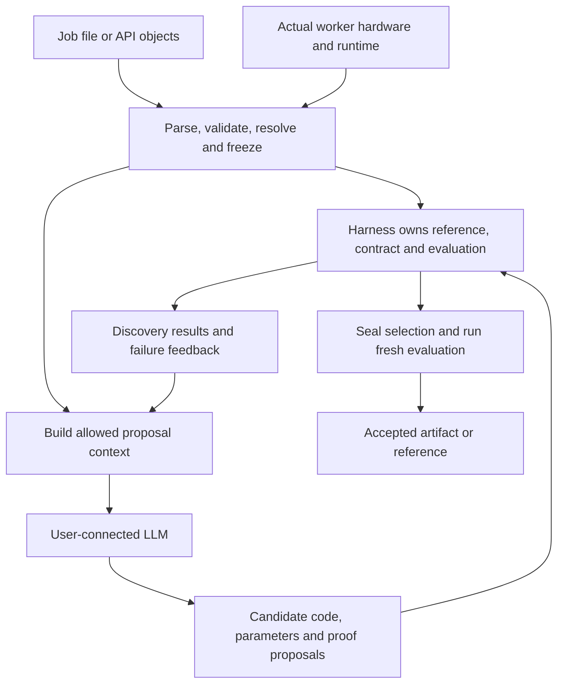

# Lossless job configuration

> Implementation status: the source alpha is now installable. See [the alpha guide](alpha.md) for supported behavior and [retention status](retention.md). This document describes the broader target design; its draft interfaces and release plans are not all implemented.

Use one job entry point, with a choice between inline configuration and references to reusable files. JSON is the only configuration format, including reusable contract and hardware files. Keep the correctness contract logically separate from the workload, objective, LLM connection, resource budget, and optional hardware profile even when they share a file. A performance preference or hardware hint cannot relax correctness.

This is a proposed interface. The [inline JSON example](../examples/lossless.json) and [split JSON example](../examples/lossless-split.json) are illustrative. Their workload, model, datasets, and LLM callback are supplied by the user rather than included in this design folder. The executable loader accepts schema version 1; these older draft examples are not executable inputs.

The examples use the retained language-model workload. The same job structure is intended for vision and numerical computation: change the workload adapter/reference, input fixtures, and contract observers. A classifier might supply image tensors and observe logits; a matrix routine might supply matrices and observe its result plus declared mutations. Tokens, samplers, and KV caches are adapter-specific fields, not requirements of the shared configuration. The `llm` section connects the optimization assistant regardless of the target. Each new adapter must define executable checks before its configuration can be accepted.

## Required inputs and optional context

| Input | Required from the user | How Lossless uses it |
| --- | --- | --- |
| Computation and reference | Executable entry point or a supported model/kernel input | Load the reference, identify editable code, build and execute candidates |
| Workload | Representative inputs or a generator; a bundled template can supply these for a demo | Derive input metadata, create discovery/confirmation partitions, validate and measure real executions |
| Contract | A supported preset or explicit requirements | Expand into concrete comparisons, state checks, and transformation preconditions before search |
| LLM connection | A callback or configured provider/model for model-driven search | Request proposals and interpretation of discovery feedback; recipes-only use is a separate mode |
| Search budget | An explicit limit, or a visibly selected template limit | Bound total work and reserve time for final confirmation |
| Objective and constraints | Optional when a template provides an explicit suitable default | Choose latency/throughput and enforce memory or other performance limits |
| Hardware profile | Optional | Guide planning; verify against the actual candidate-execution worker |
| Change scope, hints, proof references | Optional advanced context | Restrict editable regions or suggest opportunities; independently check any proof claims |

Users should not manually enter information that Lossless can obtain reliably. Infer shapes/dtypes/strides from actual inputs, obtain the function signature from the adapter, detect worker hardware/toolchains, and compute reference/source/model hashes. Derive validation checks and eligible transformations from the resolved contract. Keep one authoritative value for each parameter; conflicting declarations are errors, not silent overrides.

Some information cannot be recovered from the contract alone. A domain such as "float32 matrices up to this size" does not supply representative matrices or their production frequencies. Exactness requirements do not identify the user's function, preferred objective, or LLM credentials. Do not invent any of those. If a preset cannot define the necessary observers or state reset, report the missing adapter capability before searching.

## Choices for organizing files

**Inline mode:** `lossless.json` holds workload, contract, LLM connection, budget, and optional target settings. Hardware is detected when no profile is supplied. The [inline example](../examples/lossless.json) demonstrates this mode.

**Split mode:** the same entry point uses `contract: {"file": "contracts/exact-policy.json"}` and optionally `target: {"profile_file": "hardware.json"}`. Workloads can likewise refer to fixture files or generators. This supports reusing the same contract across machines or jobs. The [split example](../examples/lossless-split.json) shares a [contract policy](../examples/contracts/exact-policy.json) with the inline example; hardware is still automatic because no profile is supplied.

**Library mode:** pass the equivalent structured objects and an LLM callable directly through the API. Files should be a convenience rather than an obligatory serialization round-trip for an application already holding those objects.

All three modes resolve to the same job representation. A referenced section replaces that section; do not allow simultaneous inline contract fields and a contract file, recursive includes, or implicit deep merges. Resolve each file's relative paths against the file containing that path. Freeze referenced contents and hashes, not just filenames. CLI overrides, where supported for operational fields such as budget/output, must be shown in the resolved record. Correctness-policy changes require a new job rather than an override during resume.

The contract policy used here is a user-authored preset request. The earlier [expanded contract illustration](../examples/contracts/mlx-fixed-count-exact.json) shows additional reference/domain detail that appears after resolution. Lossless should bind the expanded contract to the selected workload reference; two independently declared, conflicting references must be rejected.

A hardware file should normally come from a proposed `lossless hardware --output hardware.json` command on the intended worker. Do not ask users to invent GPU capability fields or memory bandwidth figures. A manually supplied profile is declared context until checked. A remote profile permits planning for that machine, but measurements must run on that machine before making target-specific performance claims.

## Harness setup and LLM context

The files are authoritative structured setup for the harness. The harness derives a separate proposal request for the user-connected LLM. There is no required second internal model behind that connection.



| Information | Harness authority | LLM visibility |
| --- | --- | --- |
| Contract and input domain | Frozen comparison rules and eligibility checks | Normalized requirements and supported operations |
| Reference implementation | Frozen executable/source identity | Relevant source or graph, subject to the job's sharing policy |
| Inputs | Generate/load cases, reset state, keep confirmation separate | Discovery metadata and permitted examples; never sealed evaluation data |
| Hardware | Verify actual worker facts and record unknowns | Relevant verified facts, separately labeled supplied hints and documentation |
| Objective and remaining budget | Enforce scheduling and selection policy | Context for ranking useful proposals |
| Proofs | Check expected statements, obligations, scope, and dependencies | Relevant lemmas, obligations, and checker feedback |
| Credentials | Used by the configured LLM transport | Never included in prompts or candidate-worker environment |
| Results | Independently generated test/timing evidence | Discovery feedback; final evaluation stays out of further tuning for this job |

The model proposes transformations, parameters, or proof text within the allowed scope. It cannot rewrite the contract, test oracle, performance policy, hardware facts, or its own acceptance result. A valid response is parsed into a candidate record and sent to the worker/evaluator; model-generated prose is not an execution directive for the controller.

"Deterministic setup" means schema validation, contract expansion, admissibility checks, budgets, and acceptance rules are controlled by explicit code and frozen inputs. It does not mean LLM outputs or hardware timings are identical across runs. Record proposal outputs, seeds, tool versions, and raw measurements to make the process auditable. A malformed configuration or unsupported contract fails with a field-specific explanation; no hidden LLM is needed to guess its intended meaning.

## JSON configuration

Job inputs, reusable contract/profile files, provider protocol messages, and resolved run records use JSON. One parser and a versioned schema define the configuration format. Reject duplicate keys, nonfinite numbers, and unknown fields rather than introducing implicit behavior. Keep units in field names and resolve relative paths from the file containing them. The executable loader bounds JSON files to 4 MB and validates adapter-specific requirements after parsing.

CSV may be useful for future tabular workload fixtures or metric exports; it is not a configuration format. Tensor payloads remain separate from configuration and are loaded by their workload adapter.

Schema validation alone cannot establish that an adapter exists or that a contract is executable. The harness checks both before search. See [the alpha guide](alpha.md) for the implemented schema and supported adapters.

## Example job

```json
{
  "schema_version": "draft-1",
  "name": "exact-bulk-inference",
  "workload": {
    "adapter": "mlx.fixed_count",
    "reference": "workload:reference",
    "parameters": {
      "model": "./model",
      "sampler": "greedy",
      "max_new_tokens": 32
    },
    "inputs": "./requests.jsonl"
  },
  "contract": {
    "preset": "exact",
    "observables": [
      "token_ids",
      "emitted_log_probabilities",
      "active_kv_state",
      "request_order"
    ],
    "weight_changes": false,
    "precision_changes": false,
    "required_evidence": "validated"
  },
  "objective": {
    "metric": "throughput"
  },
  "llm": {
    "callback": "my_llm:complete"
  },
  "budget": {
    "wall_time_seconds": 600,
    "max_llm_calls": 20,
    "max_candidates": 40
  },
  "target": {
    "device": "auto"
  },
  "output": {
    "directory": "./lossless-runs"
  }
}
```

The example selects a fixed-count adapter; it does not imply support for EOS stopping, cancellation, or arbitrary MLX programs. The adapter must expand the exact preset into concrete input-domain, state, observer, exceptional-value, and comparison definitions. The reference callable supplies the executable computation, and its code/model/tokenizer identities are frozen before search. `validated` allows finite tests as evidence; it does not claim universal equivalence.

`my_llm:complete` names a user-supplied callable taking prompt text and returning response text. A built-in transport configuration can instead specify a provider, model, endpoint, and credential environment-variable name. Treat these as alternative connection modes, with one active mode per job. API keys never belong in configuration files or generated run records. Loading explicitly configured user code is a deliberate application action, not a configuration parser feature. Syntactic config validation should not import it.

The 600-second budget is illustrative, not a recommended demo duration. A substantial run should be estimated before launch and performed under the user's foreground-run preferences. Total job wall time includes model calls, builds, proof checks, validation, and measurement; individual stages also have timeouts. Reserve enough budget for final confirmation. If it cannot finish, keep the reference and label the search incomplete.

## What users specify and what Lossless resolves

| Section | User supplies | Lossless can supply |
| --- | --- | --- |
| Workload | Reference, inputs or an input generator, execution parameters | Supported adapter detection and input metadata |
| Contract | Preset or explicit correctness requirements; required observables | Adapter-specific expansion, reference hashes, supported checks |
| Objective | Latency, throughput, or another supported metric | A template default, visibly recorded |
| LLM | Callback or provider/model connection | Prompting, structured parsing, feedback, retries, usage records |
| Budget | An explicit bound for an actual search | Conservative per-stage limits and candidate scheduling |
| Target | Optional device selection, requirements, or supplied profile | Local worker hardware and installed runtime/compiler discovery |
| Output | Optional destination | A uniquely named local run directory |

Hardware discovery is optional user input but mandatory execution context. Detect on the machine that will run candidates, including device identity/features, CPU architecture, memory information, OS, runtime/compiler versions, and relevant precision settings. Separate supported features from mere device presence. Unknown values remain unknown; collect optional profiling counters only when available and useful.

A supplied profile can guide planning for a different machine. It cannot replace inspection of the actual target or justify measured claims for hardware on which nothing ran. User constraints are requirements to check, not overrides that rewrite detected facts. Device or required-feature mismatches stop target admission with an explanation. When several devices are eligible, show which one `auto` selected before any expensive work.

Do not infer a user's intended correctness tolerance or business objective from hardware. Inferring shape and dtype from examples is useful, but those examples do not establish the entire supported domain. Contract and objective defaults must be explicit in the resolved job.

## Additional fields worth supporting

Keep these optional unless the adapter requires them:

- **Workload coverage:** representative input files, valid shape/value ranges, expected frequency, and separate discovery/confirmation sets or a reproducible split policy. Partition related cases together and keep evaluation out of LLM context.
- **State handling:** initialization/reset, mutable outputs, continuation state, random seeds, and deterministic-reference requirements. Stateful adapters must supply these when a preset is used.
- **Performance limits:** peak memory, startup cost, first-token or tail-latency limits, and minimum useful speedup. Constraints accompany one primary objective.
- **Expected reuse:** anticipated calls or workload duration, so tuning and compilation costs can be compared with the savings.
- **Change scope:** editable functions/regions and allowed transformation families. Preserve the original reference and disallow contract edits by candidate generators.
- **Search resources:** worker memory, per-candidate timeout, token limits, and spend limits where the provider exposes enforceable accounting. Unknown cost is not zero; do not advertise a hard monetary cap without a way to enforce it.
- **Data sharing:** which source and input information may be sent to an external LLM. Local and hosted model connections use the same proposal boundary with different data exposure.
- **Deployment policy:** reference fallback, cache limits, and export format where the selected adapter supports alternatives.

A single job is the entry point whether its sections are inline or referenced; it should reference source code, model weights, fixtures, and tensor data rather than embedding all those payloads. Common execution parameters live in `workload.parameters`; per-case values can override only explicitly supported workload parameters, never contract or evaluation policy.

## Resolve before search

The proposed `lossless inspect lossless.json` command validates the file and references, resolves available defaults and detected context, and explains unsupported or missing requirements. Lightweight configuration validation can precede any reference execution; reference loading, probes, and baseline calibration must disclose their cost.

The proposed `lossless optimize lossless.json` freezes a resolved job before search. Save `resolved.json` with schema version, resolved contract, selected target, code/model/input hashes, provider identity, budgets, and effective policies. Save detected hardware, proof receipts, raw timings, and outcomes beside it. Record only redacted connection metadata and credential environment-variable names. These run records are generated outputs; users do not have to author them to get started.

User-authored files remain unchanged. Hash a deliberately canonicalized semantic record rather than raw formatting or unspecified serializer output. A changed contract, reference, target, or evaluation policy requires re-admission and new evidence; it cannot silently resume as the same experiment. Resume and deployment reuse remain distinct actions.
