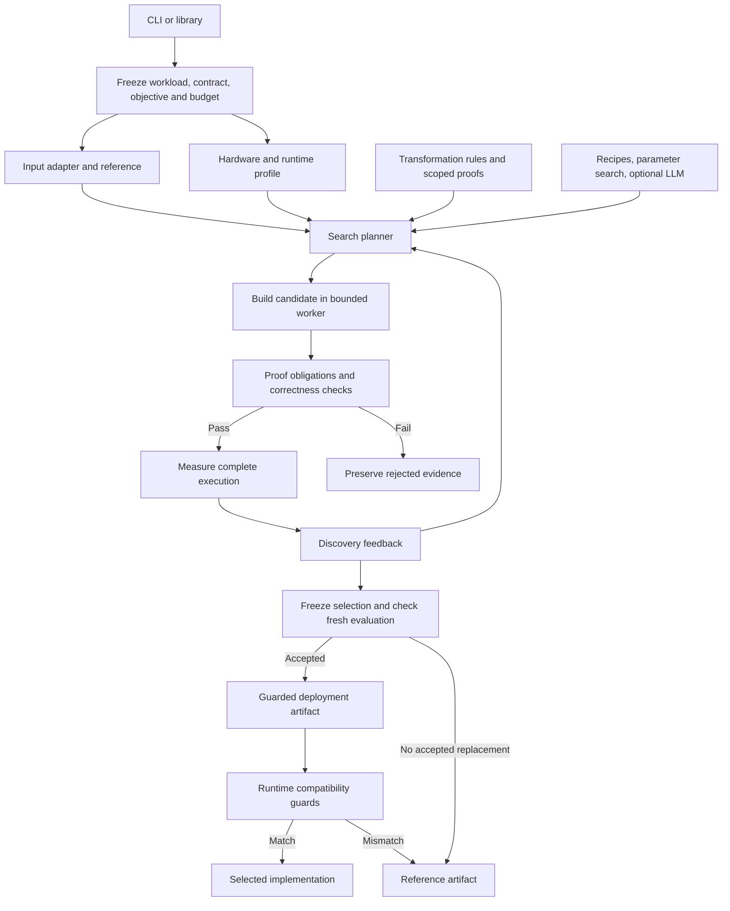

# Lossless system design

This draft defines how Lossless becomes a general optimizer with a clear user workflow. The proposed architecture separates the optimization process from the code that runs afterward. Users supply a computation and an explicit contract; Lossless searches within that contract and produces a reusable implementation with evidence and a reference fallback.

The general optimizer direction, bring-your-own LLM support, and retention of the valuable research gains are requirements. The remaining choices below are recommendations for discussion, not implemented capabilities or finalized scope.

## Product scope: ML and numerical computation

Lossless is a GPU-focused optimizer for ML and numerical computations. A job can target a whole supported model, a subgraph, an individual operation, or a linear-algebra routine. CPU references and supported CPU optimization recipes remain useful parts of the product. The optimization boundary must be explicit so the report measures the behavior the user actually deploys.

The shared workload abstraction is **inputs and optional state → outputs and updated state**. It has no mandatory tokenizer, generation loop, KV cache, or model weights. A workload adapter defines how to observe and reset its computation; an execution adapter defines how to build and run it on a supported framework/device combination. Several domains can share an execution adapter, and one domain can have several execution targets.

| Workload family | Example optimization boundary | Contract observables depend on the exposed API |
| --- | --- | --- |
| Language models | Batched inference, attention subgraphs, state movement | Tokens, required scores, continuation and sampling state |
| Computer vision | Classifier, detector, segmentation model, convolution subgraph | Required logits, boxes, scores, masks, output ordering and metadata |
| Diffusion and other iterative models | Denoiser or complete supported sampling loop | Required tensors, iteration state, random state and final outputs |
| Linear algebra and scientific computation | Matrix products, factorizations, structured solves | Output tensors, declared mutations, error bounds and failure behavior |

These are intended domains, not an implemented support matrix. Current evidence is concentrated in specific language-model inference and CPU numerical workloads. Reuse scheduling, memory, layout, graph, and kernel mechanisms where their preconditions hold; establish correctness and speed separately for each new integration.

Bring-your-own LLM describes the **optimization assistant**, which can propose improvements to a vision model or matrix routine. It does not constrain the target computation. Normal execution uses the resulting artifact without calling that assistant.

For a vision classifier exposing logits, an exact contract compares the required logit tensor and metadata, not merely the winning class. A detector or segmentation model needs its own observers. Algebraic equality over real numbers does not establish bitwise equality for floating-point execution; transformations must satisfy the selected exact or numerical contract. Training needs additional gradient, optimizer-state, and random-state semantics and is a separate support milestone.

## What the user gives and receives

An optimization job needs five things:

1. **A computation and reference.** An executable entry point, source or captured graph, and the implementation that defines existing behavior.
2. **A workload.** Representative inputs, shapes, layouts, state transitions, and expected repetition. Examples alone do not define the entire supported input domain.
3. **A correctness contract.** What must remain observable, the allowed input domain, and the comparison or certificate required.
4. **An objective.** For example, request latency or bulk throughput, with memory and first-token latency limits when relevant.
5. **A budget.** Wall time, worker memory, candidate count, and optional model-call limits.

The output is a deployment artifact, a report, and reproducible evidence. A deployment artifact includes a selected implementation, compatibility guards, and a defined way to retain or invoke the reference. Keeping the reference is a successful optimization outcome when the search finds no useful replacement.

Initial users are developers who can identify an expensive computation and provide a representative workload. Accepting arbitrary repositories and discovering every optimization boundary automatically is a later capability.

Here, **general optimizer** means the same contract, proposal, proof, measurement, and acceptance process can serve different computations. Scheduling inference, changing a cache layout, selecting a native kernel, and certifying a structured solve can share that process while using different transformations and execution adapters. It does not imply universal automatic optimization or equal support for all inputs at launch.

## Four independent interface decisions

| Decision | Meaning | Examples |
| --- | --- | --- |
| User interface | How someone requests optimization | CLI, Python library, eventual C++ client |
| Input adapter | How Lossless understands the computation | C kernel plus an ABI and fixtures; a supported vision graph; an MLX inference workload; a structured solve |
| Execution target | How a candidate is built, executed, measured, and loaded | Native CPU library; MLX on Metal; CUDA kernels |
| Candidate source | Where proposed improvements come from | Bundled recipes, parameter search, user proposals, an optional LLM |

These are independent boundaries, although each supported combination needs integration work. A Python interface can optimize C code. A C++ application can consume an exported native library without embedding the optimization process. An MLX recipe may remain dependent on MLX and Python; its export must say so.

### Why start with Python orchestration

Python is a pragmatic recommendation because the current controller, adapters, gates, and model experiments are written in it. It is convenient for invoking compilers, collecting measurements, and interacting with the existing framework APIs. The expensive computation still runs through the chosen native implementation or framework.

This recommendation does not require a Python call on a native application's execution path. For native targets, prefer an artifact callable through a small versioned C ABI, with a C++ wrapper when useful. ABI here means the agreed function signatures, tensor descriptors, ownership rules, and error behavior used across compiled components.

| Approach | Advantage | Cost | Recommendation |
| --- | --- | --- | --- |
| CLI and Python optimization library | Direct reuse of current work; easy experiment orchestration | Python environment needed for tuning | First implementation |
| Native runtime artifact with C ABI | Native applications can use the result without a Python tuning process | Must define memory ownership, compatibility, guards, and fallback | Part of the native target design |
| C++ optimization SDK | Convenient in applications already built around C++ | Additional build, linking, packaging, and API maintenance | Add when an actual integration needs it |
| Rewrite the controller in C++ | More control over host execution | Rebuilds orchestration before measuring a need | Reconsider only with evidence of a bottleneck |

The CLI and versioned job/artifact formats are the common boundary. A future C++ client should express the same jobs rather than introduce a second optimization engine.

### How to choose the supported targets

A supported target must provide reference execution, candidate construction, validation, accurate timing, resource accounting, and deployment. Hardware detection alone is insufficient.

CPU native C, MLX on Metal, and CUDA have different compilers, execution semantics, synchronization, memory behavior, and runtime integration. A general engine can share the search and decision process while adapters implement those differences. It cannot safely reuse one timing or correctness harness unchanged everywhere.

The initial target set is still open. Choose it by mapping the gains we want to retain to the implementations they depend on. Most recent exact inference gains compose within MLX on Metal; keeping them does not require a different backend for every optimization. Earlier exact MPS gains need a PyTorch/MPS path, and structured CPU solver gains need a native CPU path. If all are part of the release promise, multiple adapters are appropriate.

The current recommendation is to make the retained MLX exact recipe the first extraction target because it contains much of the work the product should preserve. Keep the exact MPS path and certified CPU work in the retention inventory rather than deleting them for architectural simplicity. A small CPU example can still make installation and first use approachable. The final launch matrix depends on measured retention and intended users, not an arbitrary one-backend cap.

## Out of the box experience

The first session should offer a no-key demo using built-in candidates, without requiring model-weight downloads, a theorem-prover installation, or knowledge of the research history. The normal search workflow includes bring-your-own LLM support from the initial working alpha. The demo target is completion within five minutes, with the actual duration reported. A missing compiler should produce one actionable diagnostic before tuning starts.

The [distribution and first use plan](distribution.md) recommends package installation into the workload environment for users and an editable source checkout for contributors. It also defines optional dependencies and release-size budgets. The following is the proposed source-checkout workflow, not a runnable quickstart today:

```sh
# From a future standalone product checkout, after implementation:
python -m pip install .
lossless doctor
lossless demo --budget 60s

# Set up a real, explicitly supported workload:
lossless init --template native-kernel --output my-workload
lossless inspect my-workload/lossless.json
lossless optimize my-workload/lossless.json --budget 3m --output runs/first
lossless report runs/first
lossless export runs/first --output optimized
```

`init` produces a reference entry point, fixtures, and a configuration with visible contract and objective settings. The user edits these to describe their computation. Templates supply adapter details so users do not implement a plugin for ordinary supported cases. Unsupported computations receive an explanation rather than a claim that arbitrary source has been optimized.

Use a single job entry point containing workload parameters, contract, objective, LLM connection, budgets, and optional hardware/output settings. JSON sections may be inline or reference reusable contract/hardware files; YAML remains an equivalent authoring option. The harness resolves these inputs into a frozen job, then supplies relevant context to the user-connected LLM. See the [configuration proposal](configuration.md), [inline JSON](../examples/lossless.json), and [split JSON](../examples/lossless-split.json). CSV remains an option for tabular workload data.

`inspect` explains supported input shapes, reference identity, contract, available transformations, target compatibility, and estimated search cost. It performs no long search. `optimize` explicitly authorizes the bounded search. It does not modify the user's reference source in place.

The report answers six questions in ordinary language:

- Was a replacement selected, and for which inputs?
- What changed and why was it eligible?
- What was proved, what was tested, and what remains an assumption?
- How did complete execution time, startup cost, and memory compare?
- How much tuning cost was incurred, and when might it pay back?
- When will execution use the reference instead?

The terminal shows progress; a local JSON report supports automation and a static HTML report supports inspection. A hosted dashboard is unnecessary for this release. Users can resume an interrupted search without losing completed attempts. Logs are unbuffered and timestamped, print at least once per batch or minute, and announce log/result paths at startup and completion. Documentation for long runs supplies foreground Terminal commands with `tee` and pipeline error propagation.

### Python convenience interface

This proposed interface drives the same job model as the CLI:

```python
import lossless

workload = lossless.Workload.from_config("my-workload/lossless.json")
result = lossless.optimize(
    workload,
    budget=lossless.Budget(seconds=180),
    llm=my_llm,  # user-supplied prompt -> response function; None uses recipes only
)
print(result.report.summary)
result.export("optimized")
```

Framework-specific convenience wrappers can follow once their adapters exist. An API resembling `optimize(model, examples)` still needs to declare state, observables, supported transformations, and fallback behavior; the short syntax cannot substitute for that definition.

`my_llm` is the user's existing callable or a configured built-in transport. Users select provider, model, endpoint, and credentials; the core does not impose a model allowlist.

### First use and repeated use

On first use, try a compatible bundled recipe or previous local artifact before searching. A published recipe carries support assumptions and evidence, not a promise of speed on another machine. Verify compatibility and perform the required local acceptance checks.

During normal execution, evaluate inexpensive guards and call the selected implementation or reference. There are no LLM calls, proof searches, or surprise tuning jobs on a request's execution path. Cache misses use the reference; further tuning is an explicit action.

## Correctness is a contract plus evidence

A contract fixes the reference identity, allowed inputs, observable outputs and state, numerical relation, mutation/aliasing behavior, and exceptional-value policy. Freeze it before search. Candidate generators cannot change it or weaken the evaluator.

Two separate fields prevent ambiguous claims:

| Field | Initial choices | Meaning |
| --- | --- | --- |
| Correctness relation | `exact`, `numerical` | Byte agreement with the reference, or an explicitly specified numerical relation |
| Required evidence | `validated`, `proved` | Finite test evidence is permitted, or all declared equivalence obligations require an accepted proof chain |

`exact + validated` means byte agreement on the declared validation set, within declared deployment guards. It is not a universal guarantee. A report should literally distinguish "tested bitwise agreement" from a proved equivalence claim. Runtime guards restrict applicability; they do not turn finite tests into a proof.

`proved` must refer to precise observables and a semantic model, with every assumed compiler/runtime boundary named. A scheduling lower-bound proof or an indexing theorem alone cannot satisfy end-to-end floating-point equivalence. If the required proof is unavailable, retain the reference. This mode is a schema and policy commitment; the current research does not provide a general end-to-end proof implementation.

Numerical mode must distinguish testing a tolerance from possessing a mathematical error certificate. Define tolerances, NaN/infinity handling, signed-zero treatment, output metadata, and any conditioning assumptions. Preserve weights and precision unless the contract explicitly says otherwise. Quantization and quality-score optimization are deferred from the first release.

The older product notes choose numerical mode as the default. With the Lossless name, I recommend an exact preset for the first-use path and explicit numerical contracts for examples such as the existing CPU softmax work. This is a proposed change for discussion. In either case the selected contract and evidence level must be visible; there is no silent relaxation after a candidate fails.

For stateful inference, generated tokens are insufficient. Depending on the declared API, observables include probabilities/logits, active KV state, continuation behavior, sampling state, stopping, and cancellation. Dead-work removal is eligible only if its result is outside the declared observables. Exact execution is relative to the supplied model artifact, including any quantization already present in that artifact.

### A concrete contract

The [draft JSON example](../examples/contracts/mlx-fixed-count-exact.json) expresses the existing fixed-count inference boundary:

```json
{
  "schema_version": "draft-1",
  "reference": {
    "entrypoint": "stock_mlx_fixed_count",
    "identity_manifest": "reference.json"
  },
  "input_domain": {
    "generation": "fixed_count",
    "sampler": "greedy",
    "stop_tokens": [],
    "cancellation": false,
    "weights": "immutable"
  },
  "observables": {
    "token_ids": "equal",
    "emitted_log_probabilities": "bitwise_equal",
    "active_kv_state": "bitwise_equal",
    "request_order": "equal"
  },
  "allow": {
    "weight_changes": false,
    "precision_changes": false
  },
  "required_evidence": "validated"
}
```

In plain language: for the same valid requests and the same pinned model/reference, preserve returned tokens, emitted probability bits, active continuation state, and request order. Do not modify weights or precision. Require finite validation evidence, reported as such; this example does not claim universal proof.

The example is illustrative and not a complete executable contract today. `reference.json` would pin model/tokenizer/source hashes, runtime versions, device assumptions, and the observer definitions; the example does not ship that manifest. Resolve and hash its contents before search, so changing a file behind the same path cannot change the reference. `active_kv_state` must expand to active tensor bytes, dtype/shape, valid lengths and offsets, and continuation semantics. Internal unused capacity need not be byte-identical if it is outside the declared interface. Required returned-state independence must still hold.

Each field must map to an implemented observer or precondition check. The manifest's reference adapter defines valid request lengths, reset/initial state, special-value handling, and error behavior. Unknown contract fields are rejected rather than ignored. Runtime admission additionally checks the actual deployment against the frozen reference and selected recipe.

This contract lets a candidate regroup independent requests, change an internal layout, or skip an unobserved terminal projection when the associated conditions are satisfied. It does not authorize deleting the final KV update, changing returned probabilities, or replacing the model with a lower-precision one. If the caller needs full intermediate logits, their contract must include those logits and some deletion recipes become ineligible.

Performance goals belong in the job policy beside the contract: for example, maximize bulk throughput subject to a stated memory limit, first-token latency limit, and minimum measured improvement. Fallback behavior, target selection, model-provider settings, and search budgets also belong in the job/deployment configuration. Separating them prevents a candidate from trading correctness for speed by editing the contract.

### JSON, Protobuf, and gRPC

Use a versioned schema for the contract section of the job configuration. JSON is sufficient for the initial interface; optional YAML authoring uses the same data model. Resolved JSON records make runs inspectable and reproducible. Tensor inputs and outputs remain in referenced files or target memory; do not encode large tensor payloads into the contract. Define canonical identity rules explicitly before hashing manifests. The [configuration proposal](configuration.md) describes inline and split-file workflows.

Protobuf is a reasonable alternative when generated typed bindings or schema evolution across several language clients becomes useful. gRPC is a service transport, for example between a local client and a remote GPU worker; it is not an alternative definition of correctness. A future service could submit jobs, stream progress, and return artifact references while using the same contract semantics. Neither belongs on every optimized function call merely because tuning uses it. See the official [Protocol Buffers overview](https://protobuf.dev/overview/) and [gRPC core concepts](https://grpc.io/docs/what-is-grpc/core-concepts/).

## System architecture

Start as a local modular application with worker processes. A versioned manifest and local evidence directory are sufficient; no distributed scheduler or service database is required initially.



### Component responsibilities

| Component | Owns | Boundary |
| --- | --- | --- |
| Contract and job model | Reference, domain, observables, objective, budget | Immutable after search begins |
| Input adapter | Input/state generation, capture, reset, observation | Cannot conceal state that the contract requires |
| Hardware profile | Device, toolchain, runtime, memory limits | Separates local facts, cited documentation, and measured observations |
| Planner | Eligible transformations, ranking, remaining budget | Can propose; cannot certify its own result |
| Proof checker | Named obligations, checked statements, assumptions | Records scope and correspondence to the implementation |
| Execution target | Build, load, synchronize, measure, export | Provides its own lifecycle and resource limits |
| Evaluator | Reference comparisons and timing protocol | Independent of candidate-generated code and claims |
| Selector | Acceptance policy and sealed evaluation | May select the reference |
| Artifact runtime | Identity checks, input guards, dispatch, fallback | Performs no discovery |
| Evidence store | Inputs/identities, decisions, raw timings, failures | Versioned, reproducible, local by default |

Keep public plugin interfaces small: `WorkloadAdapter`, `ExecutionTarget`, `CandidateProvider`, and `ProofChecker`. Internal search and selection are shared. Avoid designing a universal compiler intermediate representation before two real adapters need it.

### How formal reasoning participates

Formal reasoning has three useful jobs: check that a transformation preserves specified behavior, establish structural constraints that reduce the search space, and derive bounds within a stated cost model. Measured execution determines whether an eligible candidate helps on the actual target.

A transformation record should include its applicability predicate, proposed change, proof obligations, proof source and toolchain identity, assumptions, and tests. Link proof statements to generated implementation expressions where possible. The existing shared Lean/Metal address expression is a useful starting pattern; it still needs machine-integer range guards and an explicit account of the compiler boundary.

A proof receipt records what was checked, not just that a Lean process exited successfully. Check the expected statement, dependencies, and axiom policy. Published recipes can carry release-time receipts without requiring Lean on every user's machine; this is trust in the published evidence unless the user independently rechecks it. Generating new proofs requires the optional proof toolchain. These distinctions follow Lean's description of [proof validation and its trust assumptions](https://lean-lang.org/doc/reference/latest/ValidatingProofs/).

### How hardware information participates

Hardware facts rank plausible candidates and rule out unavailable features. Measurements test hypotheses about bottlenecks. A memory-movement lower bound is evidence about the specified model, not a physical bandwidth measurement or proof of fastest execution. Missing counters remain unknown.

A candidate might change layout, eliminate unobserved work, group operations, reuse state, select a library implementation, or specialize an existing kernel. Generating a new kernel is one available action.

### How bring your own LLM participates

Keep the simple user boundary requested in the existing notes: `llm(prompt_text) -> response_text`, with optional built-in transports for hosted and local models. Lossless owns prompts, structured proposal parsing, bounded retries, and evaluation. Users should not have to author a provider-specific JSON adapter.

This is an initial product requirement, not a deferred extension. Recommend a strong reasoning-capable model for complex optimization and proof work. The expectation is that better reasoning improves hypotheses and interpretation of failures; the realized speedup also depends on search budget, workload headroom, and validation. Record model identity, cost, valid proposals, and accepted gains so the recommendation can be evaluated rather than claiming a guaranteed monotonic relationship between model capability and speedup.

The model receives the contract, relevant code, hardware context, and discovery feedback. Sealed evaluation data remains outside proposal context. Model-provided proof claims and speedup claims are proposals until independently checked. Record available usage and latency; unknown spend remains unknown. Limit calls and tokens as well as wall time, and describe the limits of remote cancellation.

Built-in recipes work offline. External model use is explicitly configured, with a clear description of source and workload information sent. Candidate workers do not inherit provider credentials. Existing process isolation contains crashes but is not a security sandbox: automatic execution of arbitrary generated code needs an appropriate isolated environment, or an explicitly documented trusted-local development scope. The same applies to generated proof code.

## Measurements and selection

Freeze the performance policy before tuning. Validate a candidate before timing, synchronize asynchronous work, reset mutable state, and use paired randomized measurements. Record raw samples, variation, reference behavior, and resource peaks. Compare with the original reference and a strong available library/compiler baseline; a fast baseline that violates the chosen contract is ineligible and must be labeled accordingly.

Separate discovery, finalist selection, and fresh confirmation. Freeze the candidate or dispatch rule before opening final evaluation. After a failed final evaluation, fall back or begin a new search with new evaluation data; do not repeatedly select against the same holdout.

A proposed acceptance rule requires contract evidence to pass, a predeclared useful improvement supported by the measurement interval, and compliance with memory/startup/latency limits. The improvement threshold belongs to the workload policy; one percentage is not appropriate for every workload. Noisy or inconclusive runs keep the reference. Report shape coverage and regressions instead of hiding them in one average.

Include guards, dispatch, state conversion, required transfers, and output materialization in the execution boundary. Report cold start and steady state separately. An approximate break-even count is additional tuning/setup cost divided by the per-call time saved, when that saving is positive. Expected reuse and uncertainty determine whether this estimate is actionable.

## Artifact and runtime design

An artifact contains a versioned manifest, reference and candidate identities, contract, supported input domain, compatibility guards, required dependencies, build recipe or compatible binary, proof receipts, validation summary, measurement summary, and evidence references. A portable recipe is not automatically a portable binary. No downloaded weights are embedded by default, and loading an artifact must not execute opaque serialized Python objects merely to inspect its metadata.

Cache identity binds source/graph and weights where applicable, contract, observable state schema, transformation parameters, adapter version, hardware features, runtime/compiler versions, compiler flags, precision settings, and the input specialization. A changed reference, contract, or runtime invalidates admission. Full model hashing belongs at load/admission boundaries; immutable handles or explicit mutation generations avoid hashing weights on every request.

MLX explicitly documents that undeclared captured inputs are treated as constants and changed state must be supplied as inputs or captured state. That supports treating weight replacement and mutable KV state as part of cache validity, not merely array shape. See [MLX compilation and state](https://ml-explore.github.io/mlx/build/html/usage/compile.html).

The initial runtime has bounded artifact/compiled-function caches with entry and byte limits. It does not silently compile unbounded specializations during serving. Device or shape mismatch selects the reference before candidate execution. An error after mutating state cannot safely trigger an automatic retry unless the adapter can restore the original state; otherwise fail the request with diagnostics. Stateful adapters need explicit session ownership and serialization until concurrency is validated.

The runtime should expose selected recipe, fallback reason, cache hits/misses, and local timing counters without requiring a network service. Artifact hashes provide reproducibility and corruption detection, not authenticity against an adversary who rewrites the whole bundle.

## Decisions to make before implementation

1. **Retained gains and launch support.** Agree on which exact MLX, exact MPS, and certified CPU capabilities belong in the first release. Choose the required adapters from that inventory and demonstrate performance retention after extraction.
2. **Default contract.** Confirm exact-first versus the numerical default recorded in earlier notes; keep assurance explicit in either case.
3. **Native integration priority.** Decide whether the first release needs a C++ consumer example or whether CLI/Python users come first. This does not require a C++ rewrite.
4. **Publication scope.** Choose an original-code license and decide whether the first GitHub release is a design preview or a working alpha after the release gates pass.

Hosted tuning, arbitrary whole-program optimization, distributed serving, quality-based approximations, learned selectors, and new accelerator coverage can follow evidence of demand. The first implementation should complete the user journey while retaining the chosen research gains. A cleaner abstraction is not sufficient justification to discard them.
