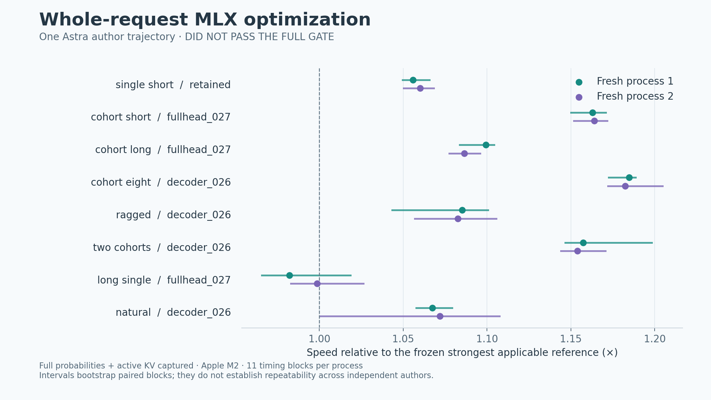

# Campaign 048: broader MLX authoring found a useful research implementation

**Keep the new implementation as experimental.** One Astra trajectory produced
six Python/MLX implementations, all passing the discovery exactness checks. The
frozen sixth implementation reached **1.09759× and 1.09845×** the strongest
applicable frozen references in two fresh held-out processes. It failed the full
deployment gate: a long single-request workload did not establish a speed win,
and one ragged first-token latency observation exceeded the declared limit.
No product recipe or default was changed.

This is actual implementation authoring across the inference execution path,
not allocator selection. It remains a standalone research harness; the product's
live MLX proposal interface has not acquired this broader capability.

[SVG](assets/fullstack-048.svg) · [Plot data](assets/fullstack-048.plot.json) ·
[Protocol and commands](../experiments/fullstack_048/README.md) ·
[Evidence archive](assets/fullstack-048.json.gz).

## What changed

The author replaced continuous-batching bookkeeping with a direct fixed-count
generation loop while retaining the existing cohort grouping. Subsequent
revisions introduced compiled prefill, compact/hybrid KV storage, the existing
copy-only Metal kernel over longer cache lengths, fewer redundant evaluations,
larger bounded asynchronous submission windows, and overlap of finished cache
exports/probability stacks with subsequent decode work.

The selected module retains the model's arithmetic and normalization shapes,
full probability capture, the final KV-producing lookahead step, and independent
exports. Only bounded compiled functions and immutable model references persist;
it does not memoize request outputs or prefill/KV across calls. Its explicit
function cache is capped at 256 entries. These are inspected source properties
and finite test results, not a proof of arbitrary compiled executions.

| Round | Author timer | Discovery geometric mean | Full discovery gate |
| --- | ---: | ---: | --- |
| 1: direct execution and compiled decode | 13:24 | 0.99520× | Failed |
| 2: compact caches and deferred prefill evaluation | 6:41 | 1.05140× | Failed |
| 3: compiled prefill and fused short-cache copies | 14:08 | 1.10752× | Failed |
| 4: preserve capacity on longer caches | 5:30 | 1.10765× | Failed |
| 5: extend copy kernel through 1,024 positions | 4:59 | 1.10961× | Failed |
| 6: overlap exports and reduce synchronization | 8:42 | 1.11147× | Failed |

All six completed without a compile/runtime rejection or timeout. Every candidate
passed the tested exactness, memory and reported-latency requirements on all eight
discovery families. Each failed at least one per-case speed interval. The highest
eligible mean was selected by the frozen rule; the later tiny changes in mean
do not establish that each revision was statistically better than its predecessor.
No manual proposal repair occurred.

## Held-out result and rejection

Ratios below pool the two fresh-process ratios geometrically. Each process has
eleven randomized paired timing blocks per case. Timing includes input handling,
tokenization, execution, full MLX probability/state materialization, decoding and
response serialization. Byte hashing and continuation checks are outside timing.

| Workload family | Frozen reference | Selected / reference | Selected / stock serial |
| --- | --- | ---: | ---: |
| Short single request | Retained | 1.05805× | 1.10385× |
| Four short equal-length requests | Fullhead 027 | 1.16351× | 1.76020× |
| Four longer equal-length requests | Fullhead 027 | 1.09282× | 1.59165× |
| Eight equal-length requests | Decoder 026 | 1.18357× | 2.01440× |
| Four ragged requests | Decoder 026 | 1.08391× | 1.14011× |
| Two prompt-length cohorts | Decoder 026 | 1.15558× | 1.94872× |
| Long single request | Fullhead 027 | 0.99044× | 1.07180× |
| Four distinct natural/code requests | Decoder 026 | 1.06968× | 1.14127× |
| **Geometric mean** | **Per-family frozen choice** | **1.09802×** | **1.42424×** |

Seven families had lower paired 95% intervals above one in both processes. The
long-single ratios were **0.98226× [0.96571, 1.01862]** and
**0.99869× [0.98309, 1.02627]**. It also missed the discovery interval gate.

The second process recorded a **233.83 ms** maximum reported first-token time
for the ragged candidate versus **139.52 ms** for its reference. The predefined
limit was reference ×1.10 +5 ms, or **158.47 ms**. The other candidate observations
were much lower, but the rule uses the maximum; this observation is retained and
causes rejection. First-token timestamps are implementation-reported and range
checked, not independently instrumented token-emission traces.

Every final token/order, full probability-array and active-KV comparison passed,
as did forced continuation, previous-call state, independent-export and weight
immutability checks. All final memory limits passed. Observed candidate warm
MLX peaks reached approximately **321.1 MiB**, including shared live validation
outputs; this is not incremental deployment memory and excludes some driver/RSS
memory. A separate worker RSS cap was enforced.

The 1.424× stock-serial ratio includes gains already available in the retained
recipes. The incremental result of interest is approximately 1.098×. Existing
methods were screened before authoring: serial, raw stock batching, retained,
decoder-026 and fullhead-027, with the shipped 64-entry graph setting. Raw stock
batching failed exactness on the multirequest discovery cases and remained a
diagnostic control. This is the strongest observed eligible reference among
those choices, not an exhaustive tuning of every MLX configuration.

## Time, startup and payback

The one-hour maximum search counter used **57 min 12 s**. Six calls completed;
the measurement reservation/minimum-call rule left 2 min 48 s unused. Including
initial profiling and final evaluation, the counter recorded **59 min 59 s**.

**Actual elapsed time was 82 min 16 s.** The Mac entered lid-close sleep during
round three. This Python's `time.monotonic()` uses `mach_absolute_time()`, which
pauses during sleep. UTC logs show **79 min 28 s** from search start to selection,
about 22 min 16 s more than the search counter. Selected power transitions and
the timestamped controller log are preserved in the evidence. No GPU worker was
running during that sleep; remote author compute during the interruption is
unknown. This is not an uninterrupted 60-minute wall-budget experiment.

Completed CLI receipts recorded **380,267 input tokens and 94,367 output tokens**,
with no missing usage receipt. Reasoning tokens are not added again to output
counts. Dollar cost is unknown; these calls used the existing ChatGPT-signed-in
Codex CLI and subscription allowance. Building the harness and smoke tests are
outside the campaign durations above.

Candidate construction took **1.41–1.66 ms** in the final workers. First calls
were workload-dependent: short-single calls were **71–75 ms** versus **42 ms**
reference; long-single calls were **124–135 ms** versus **82–84 ms**. Some grouped
first calls were faster than the reference. These are first calls per workload
in a shared loaded worker, not isolated compiler benchmarks; earlier calls can
warm shared infrastructure. Model admission/loading took **0.35–0.38 s** separately.

For each final process/case, the analysis computes:

\[
N_{\mathrm{break-even}} = \left\lceil
\frac{T_{\mathrm{search}} + \max(0,T_{\mathrm{constructor}} +
T_{\mathrm{candidate\ first}} - T_{\mathrm{reference\ first}})}
{T_{\mathrm{reference\ warm}}-T_{\mathrm{candidate\ warm}}}
\right\rceil.
\]

Among cases with positive measured savings, search-counter plus extra setup
payback was **123,918–1,897,126 repeated workload calls/batches**. Charging the
entire **82:16 wall-clock campaign**, including the sleep, gives
**178,209–2,728,285 calls/batches**. The long-single case has no finite payback in
either process. These are per-case point estimates, not a workload-weighted or
confidence-guaranteed business case. This is a prototype, with no measured
production export/load workflow.

## Scope and next action

Recorded setup: Apple M2, macOS 26.6.2 arm64, Python 3.11.3, MLX 0.32.3,
mlx-lm 0.32.0 and NumPy 2.4.6, with the admitted 8-bit SmolLM2-135M artifact.
Weights and precision were unchanged. One author trajectory and two final
processes do not establish a model ranking or independent-author repeatability.
There was no equal-budget whole-stack enumeration/random-search arm here.

The synthetic families repeat one word, so equal-length rows contain identical
prompts; natural/code requests are distinct. No production arrival trace, other
model/device, arbitrary input domain or generic non-LLM graph was qualified.
Finite exact checks are not a formal proof. Compile-cache saturation, broader
shape sequences, cold-start economics, first-token latency and integration guards
still need deployment qualification. The selected source has a 256-entry cache,
outside the product graph recipes' current 128-entry hard maximum.

The useful follow-up is a preregistered qualification campaign covering more
distinct prompts and shape sequences, with latency and compilation-cache controls.
The seven winning final families suggest where to investigate; selecting them
after this evaluation does not itself qualify a new deployment scope. Keep the
long-single and ragged latency failures as regression cases. In parallel,
[broaden the workload corpus with a KernelBench-derived pilot](workload-expansion.md)
before drawing claims about general optimization or collecting data for training.

## Evidence

Selected source SHA-256:
`a3f795bc5f1a7c2fea2fa69953d7939ca1ac322b171b21a03fd4281c0be49d5d`.

Archive SHA-256:
`ff03351bf96306e45b3b37dd35ddfe7e9c75fbb5f3365ec0ddd33927f8f1e291`.

The archive contains frozen harness/resources, all six proposals, discovery and
final measurements/check records, prompts, completed-turn receipts, source
identities, clocks and smoke controls. It excludes raw CLI event streams, stderr,
authentication data and model weights; local paths in records are redacted. Array
digests commit observed bytes; the pinned worker/model are needed to recompute
the arrays. The analysis recomputed every recorded assessment from raw samples
and verified frozen-source, reference and selection digests. The unchanged seed
passed a Metal smoke, deliberately wrong probabilities were rejected, and four
protocol regression tests passed.
