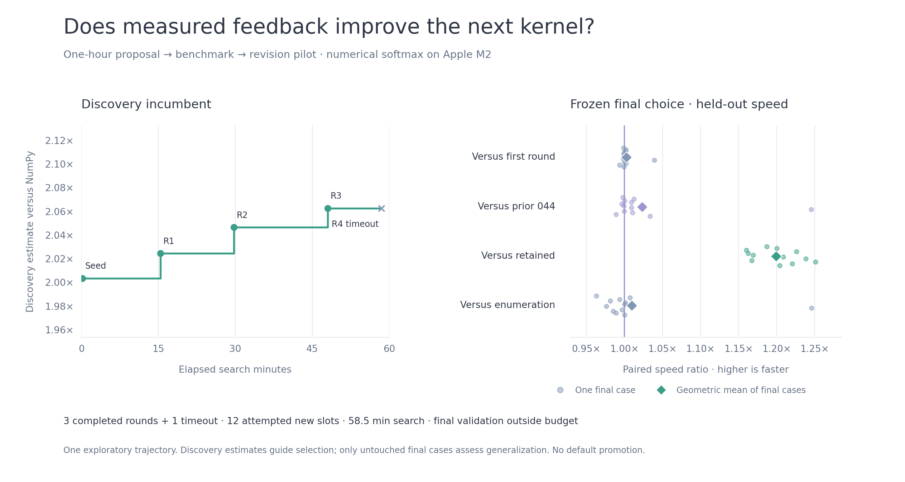

# Campaign 045: one-hour propose → benchmark → revise

**Revisions did not establish a useful overall improvement beyond the first
round.** One `gpt-6-astra` / `xhigh` trajectory completed three batches of three
proposals; a fourth response timed out. The final choice measured **1.00284× the
first-round choice** on fresh paired cases, with one confirmed case regression.
The predeclared incremental improvement gate failed.

This is numerical CPU softmax on Apple M2, not exact MLX inference. All nine
returned proposals passed finite numerical validation. No kernel was promoted
to a product default; one trajectory cannot establish how iterative search
performs across independent authors or workloads.



[SVG](assets/iterate-045.svg) · [Compressed source evidence](assets/iterate-045.json.gz) ·
[Frozen study harness and protocol](../experiments/iterate_045/README.md)

## Results

Choices were frozen before opening any final case. These are direct paired
measurements of the final choice, `round03_candidate0`, against each named
reference, with twelve fresh shape/layout cases per comparison. Ratios above
one mean faster execution; percentages express speed increases, not latency
reductions.

| Reference | Final / reference, geometric mean | Cases with lower 95% interval >1× | Cases with upper 95% interval <1× | Incremental gate |
| --- | --- | --- | --- | --- |
| First-round choice | 1.00284× (+0.28%) | 1/12 | 1/12 | Failed |
| Prior campaign-044 kernel | 1.02339× (+2.34%) | 3/12 | 0/12 | Failed |
| Retained column-4 recipe | 1.19928× (+19.93%) | 12/12 | 0/12 | Passed |
| Enumerated choice | 1.00958× (+0.96%) | 2/12 | 4/12 | Failed |

The incremental gate required geometric-mean speed at least 1.02× **and every
case's lower paired interval above 1×**. The final choice and enumeration both
passed the separate frozen NumPy deployment-comparator gate, measuring 2.00194×
and 2.00556× buffered NumPy respectively in their evaluation jobs. Ratios from
separate jobs should not replace the fresh paired comparisons above.

The largest Fortran case, 103×1567, accounts for much of the incremental result:
the final kernel was 1.24527× the prior kernel and 1.03942× the first-round
choice there. The 17×1021 Fortran case regressed to 0.99394× the first-round
choice, with interval [0.99037, 0.99743]. Against enumeration, confirmed
regressions occurred at 5×199 C, 39×797 C, 17×1021 C and 17×1021 Fortran.
These mixed results do not justify blanket replacement of the references.

All nine distinct returned proposals compiled and passed every discovery and
final numerical check: **1,134 candidate/distribution checks** (9 candidates ×
21 cases × 6 distributions), with zero failures. The complete two-arm search
recorded 13,608 passing checks including repeated references, before the extra
paired comparisons. These counts do not represent independent workloads or a
universal floating-point proof.

## What happened during the hour

The author was told the elapsed and remaining search time at each response's
start and received discovery timings, prior sources and bounded failure
diagnostics. Each response ran in a fresh isolated CLI session without tools;
the external controller carried the experiment state between responses.

| Step | Author elapsed | Total search elapsed at checkpoint | Choice's discovery estimate versus NumPy |
| --- | --- | --- | --- |
| Three shared seeds | — | 0:10 | 2.00359× |
| Round 1, three proposals | 15:03 | 15:23 | 2.02458× |
| Round 2, three proposals | 14:11 | 29:43 | 2.04663× |
| Round 3, three proposals | 18:08 | 48:01 | 2.06270× |
| Round 4, no completed response | 10:29, timed out | 58:30 | 2.06270×, unchanged |

Round one explored classification-first processing, four-row packing for
Fortran layouts, and a small verified value palette. Later rounds increased
the packing group to eight/sixteen rows and revised classification and
constant/two-value/single-exception paths. The final source retained sixteen-row
packing and added initial-run skipping and a singleton fill-and-patch path.
These describe the submitted code; this study does not isolate each change's
performance contribution.

The one-hour cap included initialization, author calls, compilation and
discovery. Each response had at most 30 minutes, clipped to remaining search
time with 90 seconds reserved for measurement. A new call needed at least
three minutes of response allowance. Round four exhausted its clipped
10:29 allowance, leaving only the reserve, so discovery ended after **58:30**.
This stopping rule does not mean the author had exhausted useful ideas.

The controller allowed eight rounds / 24 new slots. Four attempts consumed
12 slots, including three for the timed-out response; nine kernels were
actually submitted. No response was retried. The first-round choice was saved
before later feedback, and no final result was used to reselect a winner.

## Cost and payback

| Component | Actual elapsed time |
| --- | --- |
| All four author attempts | 57.85 min |
| Iterative search, including authoring and discovery | 58.50 min |
| Iterative final evaluation | 41.58 s |
| Iterative search + final evaluation | 59.20 min |
| Enumeration discovery | 47.31 s |
| Enumeration discovery + final evaluation | 97.92 s |
| Complete run, including controls and extra paired comparisons | About 61 min 2 s |

The run began 2026-10-04 02:44:40 UTC and completed at 03:45:42 UTC. Completed
response receipts report 103,293 input and 70,692 output tokens, including
35,621 reasoning tokens. Of those reported input tokens, 36,736 were cached.
Round four supplied no usage receipt: its consumption is **unknown**, not zero.
Billing dollars are unknown. Provider latency and caching were not controlled,
so elapsed time is not a pure measure of reasoning compute.

Enumeration used the same three seeds and twelve new candidate slots, from a
frozen shuffled grid of scalar `expf` unrolling, two-value detection and
scalar/vector normalization. It received identical maximum candidate/timing
allowances, but used much less actual time. This is a specific cheap control,
not an exhaustive comparison against every non-LLM search strategy.

| Reference | Cases with positive measured saving | Search-only break-even on those cases |
| --- | --- | --- |
| First-round choice | 5/12 | 210 million–704 billion calls |
| Prior campaign-044 kernel | 8/12 | 46.0 million–3.68 trillion calls |
| Retained recipe | 12/12 | 47.1 million–7.64 billion calls |
| Enumeration | 5/12 | 47.3 million–426 billion calls |

Other cases have no positive measured saving and no finite break-even estimate.
These are point-estimate lower bounds, not assured returns: near-zero savings
are especially noisy. Deployment setup is unmeasured and full
`break_even_calls` remains null. The first-round comparison charges the
additional 43.82 minutes after its checkpoint, including final evaluation;
the other comparisons charge the whole 59.20-minute iterative arm. Historical
campaign-044 authoring, study engineering, controls and extra scientific paired
measurements are excluded. The prior kernel's research cost is not recovered
by these figures.

## Measurement scope and limitations

- Nine discovery cases: 8×193, 47×773 and 96×1537, each with C, Fortran and
  sliced layouts. Twelve fresh final cases: 5×199, 39×797, 103×1567 and 17×1021
  in those layouts. Both selections were sealed before any final measurement.
- Buffered NumPy was the frozen deployment comparator. The independent float64
  oracle checked finite float32 inputs with absolute value at most 10,000,
  positive nonoverlapping strides, `atol=2e-7`, `rtol=4e-5`, nonnegative outputs
  and row sums within 2e-6 of one, plus buffer guards and unchanged inputs.
  No approximate exponential, reduced precision, threads or compiler-flag
  changes were authorized.
- **Timing used Gaussian inputs only.** Correctness covered Gaussian, uniform,
  extreme, constant, single-peak and shifted inputs. The author prompt listed
  validation distributions but did not explicitly identify the timing
  distribution. Several proposals emphasized structured-row shortcuts, whose
  speed benefits this run therefore does not establish. This limitation was
  noticed during authoring and recorded without changing the frozen protocol.
- Five screening and fifteen confirmation timing blocks used 0.5 ms target
  batches, single-thread settings, separate workers and disabled compilation/
  evidence caches. Timing intervals concern repeated samples of each particular
  kernel pair, not uncertainty across independent authors. Correlation and
  machine drift remain limitations for small gains.
- One trajectory started from an already strong campaign-044 kernel. This
  cannot establish the value of feedback from scratch, optimal response caps,
  or a general relationship between more time and faster code. The rising
  discovery curve is subject to selection effects; its apparent 1.88% gain
  after round one shrank to 0.28% in fresh paired evaluation.

The environment was Apple M2 / arm64 macOS, Python 3.11.3, NumPy 1.26.4,
SciPy 1.16.0, Apple clang 21.0.0 and Codex CLI 0.159.0. The repository base was
`487e0eae025e80e7c8a03efb6ba7b3aa7980855a` with local changes, including the
configurable 30-minute response default. Exact package and harness source
hashes were frozen before the run; the archive embeds those sources rather
than implying the base commit alone reproduces this environment.

## What to keep and investigate next

Keep the reusable bounded loop, explicit time feedback, checkpoints, frozen
first-round comparison and untouched final evaluation. Keep the current
configurable 30-minute response default; this pilot provides no reason to
increase it or promise an hour of search will help. Retain the candidates as
research evidence rather than replacing product recipes.

The next useful protocol would explicitly describe the timed input distribution
and request one targeted proposal per response, allowing earlier feedback and
less repeated source output. That is an untested hypothesis, not a demonstrated
speed improvement. Repeat independent trajectories with fresh final cases and
the cheap enumeration control before drawing broader conclusions. Profile and
qualify the Fortran packing change separately if pursuing that scoped gain.

## Reproduce and inspect

[Foreground commands and configurable limits](../experiments/iterate_045/README.md)
are in the experiment directory. A fresh run requires an authenticated CLI
exposing the selected model and flags; the complete run can exceed one hour
because final validation and controls are outside discovery's cap. This
experimental CLI harness is separate from the packaged provider interface.

Regenerate the chart without model calls or native benchmarks, with optional
`matplotlib` installed:

```sh
python lossless-product/scripts/plot_iterative_study.py --evidence lossless-product/docs/assets/iterate-045.json.gz --output lossless-product/docs/assets
```

The renderer verifies plotted paired ratios against raw confirmation samples.
The left panel shows discovery estimates, and the right panel shows twelve
case ratios and their geometric mean for each frozen comparison. The archive
contains 1,392 JSON records and 76 source files, with original digests before
path redaction. Raw CLI streams, temporary runtime/auth metadata and binaries
are excluded. Bundle SHA-256:
`f6926de9fa683a325d97d8da8db3081b485d6a0a33f6a9f3af68df2376d19ca4`.
