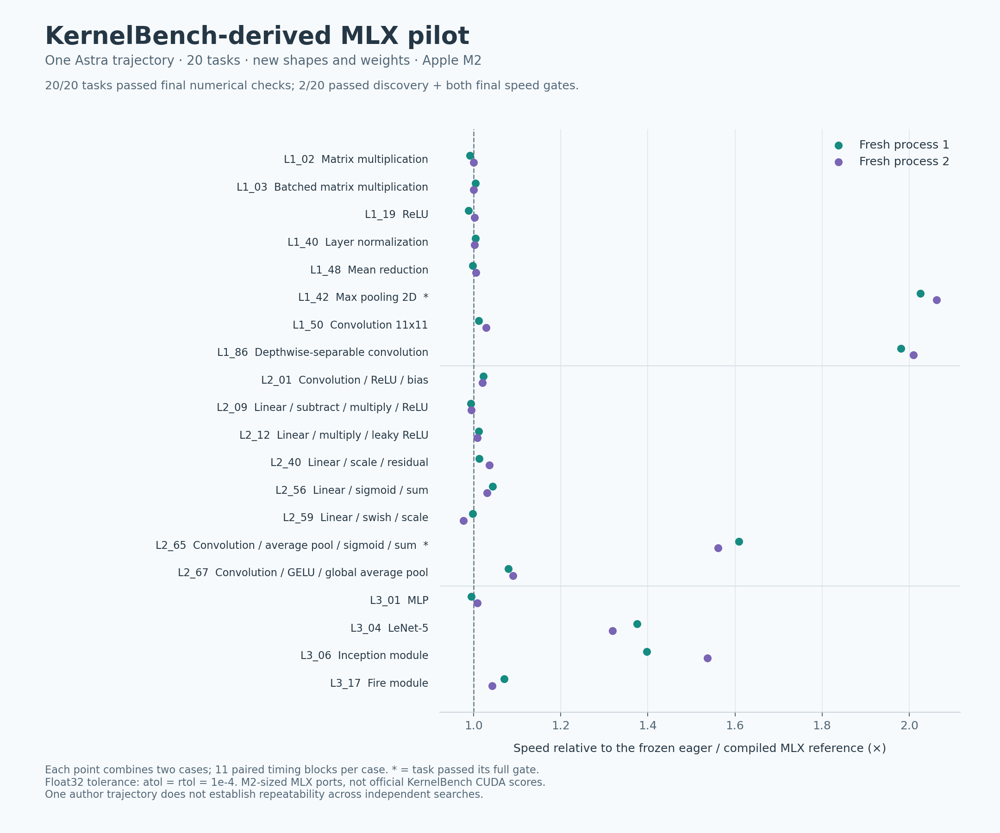

# Campaign 049: KernelBench-derived MLX search found two scoped wins

**Twenty tasks passed final numerical checks; two passed their full speed gates.**
The selected implementation reached **1.14634× and 1.15098×** the frozen MLX
references in two fresh held-out processes, or **1.14865×** pooled geometrically.
Max pooling and a convolution/average-pooling pipeline passed discovery and both
final confirmations. The full-suite gate failed. No product recipe was promoted.

This is a **KernelBench-derived MLX pilot on an Apple M2**, using reduced and
varied sizes. It is not an official KernelBench CUDA score, a bitwise experiment,
or a generic PyTorch-to-MLX product adapter. Author model weights were not trained.

[SVG](assets/kernelbench-049.svg) · [Plot data](assets/kernelbench-049.plot.json) ·
[Protocol and commands](../experiments/kernelbench_049/README.md) ·
[Evidence archive](assets/kernelbench-049.json.gz).

## Workloads and comparison

The suite contains eight operators, eight fused computations, and four graphs:
an MLP, LeNet-5, an Inception module and a Fire module. The unchanged upstream
`Model` sources and MIT license are vendored from
[KernelBench revision 423217d](https://github.com/ScalingIntelligence/KernelBench/tree/423217d9fda91e0c2d67e4a43bf62f96f6d104f1).
The [manifest](../experiments/kernelbench_049/upstream/manifest.json) pins each
source hash; [task definitions](../experiments/kernelbench_049/tasks.py) declare
the actual shapes, parameters, layouts and seeds. Upstream default sizes were
not used: several require gigabytes of memory on their own.

Each task has two discovery shape/layout profiles and two different final
profiles. Five distributions cover uniform, normal, zero, alternating-sign and
near-constant data. The second shape profile uses transposed MLX views. Final
cases change dimensions, parameter values and seeds; their oracle data was
generated only after sealing the winner. All task families were visible to the
author. This does not test optimizer transfer to unseen task families.

The frozen float32 contract requires matching shapes/dtypes, finite outputs and
`abs(candidate-reference) <= 1e-4 + 1e-4*abs(reference)` for every element, against
both an independent CPU execution of the original PyTorch model and the direct
MLX port. Inputs, original parameters and previously returned outputs are checked
for mutation. These finite tests do not prove all-input numerical bounds or
bitwise equivalence. Graph weights are randomly initialized, not trained models;
this is computation evaluation rather than a task-quality benchmark.

Before authoring, seven timing blocks screened eager MLX, `mx.compile`, and
shapeless compilation. One fastest correct method was frozen per task by the
geometric mean over its two discovery profiles: **7 eager, 9 compiled, 4
shapeless**. Shapeless pooling paths with unsupported shape inference and one
GELU case exceeding tolerance were excluded, with their failures retained.
This is the strongest observed eligible choice among those three methods on
discovery, not exhaustive library tuning on every future shape. CPU PyTorch was
the independent correctness oracle, not the timed performance comparator.

Final measurements use eleven randomized paired blocks per case in each fresh
process. A block averages 1–32 individually synchronized calls, calibrated from
the fixed eager reference. Timing starts with ready MLX inputs and ends with a
ready MLX output, including Python dispatch and in-call layout transformations.
Fixture generation, host/device input conversion and correctness checking are
outside timing. These are warm forward-call results, not application request
latencies. Bootstrap intervals resample blocks, not individual inner calls.

## Results across all twenty tasks

Means below combine the two final cases and two processes geometrically.
The full per-task gate requires correctness/memory eligibility, a mean of at
least 1.02× and both cases' lower paired 95% intervals above one, in discovery
and each final process. The full-suite gate applies the analogous rule to all
forty cases. An unchanged reference fallback therefore does not itself establish
a speed win. All twenty tasks remain in the denominator.

| Task | Frozen reference | Held-out mean | Full task gate |
| --- | --- | ---: | --- |
| L1_02 Matrix multiplication | Eager | 0.996× | Not confirmed |
| L1_03 Batched matrix multiplication | Compiled | 1.002× | Not confirmed |
| L1_19 ReLU | Eager | 0.995× | Not confirmed |
| L1_40 Layer normalization | Shapeless | 1.003× | Not confirmed |
| L1_48 Mean reduction | Compiled | 1.001× | Not confirmed |
| **L1_42 Max pooling 2D** | **Compiled** | **2.044×** | **Passed** |
| L1_50 Convolution 11×11 | Eager | 1.020× | Not confirmed |
| L1_86 Depthwise-separable convolution | Compiled | 1.995× | Missed discovery |
| L2_01 Convolution / ReLU / bias | Shapeless | 1.021× | Not confirmed |
| L2_09 Linear / subtract / multiply / ReLU | Compiled | 0.994× | Not confirmed |
| L2_12 Linear / multiply / leaky ReLU | Shapeless | 1.010× | Not confirmed |
| L2_40 Linear / scale / residual | Compiled | 1.024× | Not confirmed |
| L2_56 Linear / sigmoid / sum | Compiled | 1.037× | Not confirmed |
| L2_59 Linear / swish / scale | Eager | 0.987× | Not confirmed |
| **L2_65 Convolution / average pool / sigmoid / sum** | **Eager** | **1.585×** | **Passed** |
| L2_67 Convolution / GELU / global average pool | Eager | 1.085× | Not confirmed |
| L3_01 MLP | Eager | 1.002× | Not confirmed |
| L3_04 LeNet-5 | Compiled | 1.347× | Not confirmed |
| L3_06 Inception module | Compiled | 1.466× | Missed discovery |
| L3_17 Fire module | Shapeless | 1.056× | Not confirmed |
| **Geometric mean** | **Per-task frozen choice** | **1.149×** | **Full suite failed** |

Depthwise convolution and Inception passed both final process speed gates, but
missed the selected source's discovery gate. LeNet, GELU/reduction and several
other tasks had promising means without passing every required interval. These
are follow-up candidates, not extra confirmed wins. Differences on unchanged
fallback tasks also show timing noise and wrapper overhead; tiny ratios near
one should not be interpreted as new algorithmic gains.

For the two confirmed tasks, held-out input shapes are `[3,7,23,24]` and
`[7,17,47,48]`, with contiguous and transposed-view layouts respectively:

| Task / profile | Process 1 ratio [95% interval] | Process 2 ratio [95% interval] |
| --- | --- | --- |
| Max pool, smaller | 1.502× [1.464, 1.557] | 1.533× [1.491, 1.568] |
| Max pool, larger / view | 2.732× [2.613, 2.772] | 2.775× [2.717, 2.810] |
| Convolution/pooling pipeline, smaller | 1.201× [1.168, 1.239] | 1.241× [1.189, 1.287] |
| Convolution/pooling pipeline, larger / view | 2.155× [2.115, 2.194] | 1.963× [1.314, 2.464] |

Every final numerical, protected-state and memory check passed. The largest
recorded candidate warm MLX allocation was **64.5 MiB**, including shared live
fixtures/validation arrays and excluding some driver/process allocations. It
is not the candidate's incremental deployment footprint. The largest fraction
of the per-element numerical error allowance used was approximately **0.754**,
in an unchanged layer-normalization fallback case.

## What the author actually changed

The selected fourth-round module implements eleven tasks and uses the supplied
reference for nine. Source review found real MLX/Metal changes, no evaluator or
clock modifications, and no cached outputs or input-derived data across calls.
The explicit compiled-function cache is capped at two entries per `Runner`.
This review is not a proof of compiled-code correctness or a security sandbox.

The two clearest mechanisms are:

- **Strided Metal max pooling:** directly index the incoming layout; change
  thread traversal for transposed views while writing the same logical output.
- **Convolution/average-pooling fusion:** precompute a box-filtered convolution
  kernel and execute it at stride four, then fuse bias, sigmoid and reduction.
  This uses linearity to remove intermediate work. It changes floating-point
  rounding and belongs under the declared numerical contract.

Other changes include a direct depthwise kernel followed by channel-first matrix
multiplication, shared Inception projections, LeNet pooling epilogues and a fixed
weight permutation for NHWC flattening, and an 8 MiB bound on patch extraction
for the large convolution. Fused GELU/reduction uses an explicit float32 erf
approximation. None of these results implies bitwise preservation for the existing
LLM inference contract.

## Search time, failures and payback

One GPT-6 Astra `xhigh` trajectory used the existing ChatGPT-signed-in Codex CLI.
There were **five calls, three valid measured implementations, one provider
capacity failure, and one response timeout**. No proposal was manually repaired.

| Call | Author elapsed | Discovery mean | Outcome |
| --- | ---: | ---: | --- |
| 1 | 12:13 | 1.09020× | Numerically/memory eligible |
| 2 | 8:28 | — | Provider reported model at capacity |
| 3 | 13:26 | 1.07679× | Eligible; incumbent retained |
| 4 | 14:56 | 1.09904× | Eligible; selected |
| 5 | 8:12 | — | Clipped response allowance expired |

The search used **58:00** of its 60-minute ceiling. The final response cap was
492.44 seconds, reserving two minutes for measurement; after its timeout the
minimum-call rule prevented another attempt. Including initial screening and
final evaluation, the campaign took **58:48**. The sleep-inclusive elapsed clock
and UTC timestamps agree to their recording precision. Porting, harness work and
development smokes are outside these durations. The 16-call cap was not binding.

Completed-turn receipts report **131,299 input tokens and 66,202 output tokens**.
Two failed calls have no completed usage receipt, so these are known recorded
totals, not a complete accounting of all provider work. Reasoning tokens are not
added again. Dollar cost is unknown; no API-key billing or cloud GPU was used.

Candidate constructors took **0.004–1.63 ms** across final cases. First calls
ranged from **0.19 to 105.86 ms**, with the maximum in the scaled-linear case.
They share a worker and already-warm reference infrastructure; they are not
isolated device/compiler cold starts. No production export/load workflow was
measured.

The analysis reports
`ceil((search time + positive extra setup) / positive warm-call saving)`.
Extra setup includes candidate module import, constructor and first call, minus
the reference constructor and first call. With no positive saving, payback is
null. For the **two confirmed tasks**, charging the entire shared search gives
**3.01–61.87 million repeated calls**; charging the full campaign gives
**3.05–62.72 million**. Reusing already-discovered code and charging only observed
extra setup gives **0–578 calls**. These are per-case point estimates, not a
workload-weighted or confidence-guaranteed business case.

The later selected discovery mean does not establish an incremental gain over
the first author response: there was no fresh paired first-versus-fourth test.
Compiler screening is a useful non-LLM control, but this run has no equal-cost
random/enumerated implementation-search arm. It cannot establish model rankings
or repeatability across independent author trajectories.

## What to keep and test next

Keep the pinned task corpus, validated ports, fixed evaluator and recorded
trajectory. Prioritize extracting the strided pooling and folded-convolution
changes into guarded research recipes, followed by new preregistered qualification
on more shapes, layouts and data ranges. They passed this pilot's per-task gates;
they are not yet product deployment artifacts.

Depthwise convolution and Inception merit another qualification campaign because
their final gains were substantial, while the discovery intervals did not clear
the rule. Do not drop those earlier failures or reuse these now-observed final
cases as a new untouched test set. Test mixed shape sequences, cache lifetime,
larger memory-bound workloads and real application graphs before generalizing.

The [workload expansion plan](workload-expansion.md) remains useful: this pilot
adds varied evaluation evidence, not model training. A future training corpus
should retain failures, timings, contracts and source identities as well as
winners, and separate entire task families when testing optimizer transfer.

## Evidence and validation

Recorded environment: Apple M2 with 8 GB unified memory, macOS 26.6.2 arm64,
Python 3.11.3, MLX 0.32.3, NumPy 2.4.6, CPU PyTorch 2.14.0, Codex CLI 0.159.0.

Selected source SHA-256:
`419e50cc457f222352ed1d7058073e10900d14faf593cfcc69cf3c1dd6f8b42c`.

Archive SHA-256:
`e12fef8ea68994237e3afc133c869949adde99ff5dfbb2df323d8b9e527ef23e`.

The archive preserves frozen source/resources and the upstream license, complete
proposals/prompts, failure receipts, raw measurements, numerical diagnostics,
source reviews and oracle fixture identities. It excludes raw CLI event streams,
stderr, authentication state and bulky fixture arrays. Local paths in records are
redacted; original record digests precede redaction. Fixtures can be regenerated
using the pinned source, runtime and seeds; originals remain in the ignored local
output directory.

The audit verified frozen source, plan, references, selected source and fixture
hashes; recomputed all recorded assessments; and reconstructed baseline selection.
All forty discovery ports and forty unchanged-candidate cases passed the smoke,
while deliberately wrong outputs were rejected. Four CPU protocol regression tests
passed. Repository Ruff checks and formatting checks passed, with unchanged
vendored upstream files excluded from rewriting/linting.
