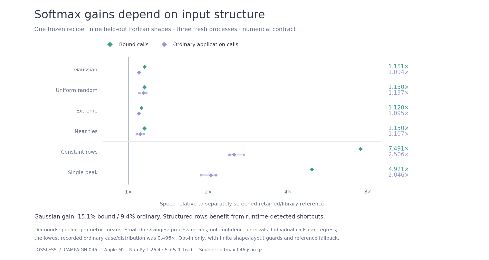

# Campaign 046: a scoped, usable numerical softmax recipe

**Keep the campaign-045 first-round kernel as an opt-in recipe for 19 validated
Fortran shapes.** Broad promotion failed. The large-Fortran scope passed the
predeclared gate in discovery and in three fresh confirmation processes; the
normal product workflow then accepted it, and real exported-artifact checks
passed. Default native recipes remain unchanged.

The [ready-to-run example](../examples/softmax-fortran/README.md) requires no LLM,
API key or model weights. It revalidates the frozen source on the current host,
exports exact shape/layout guards and falls back to the independent reference
outside those cases. This is numerical CPU softmax, not a bitwise or whole-model
inference result.

## Results

Recorded host: Apple M2, macOS 26.6.2 arm64, Python 3.11.3, NumPy 1.26.4,
SciPy 1.16.0. Qualification took **435.70 seconds**. Three fixed candidates were
tested: campaign-044 winner, campaign-045 first-round choice and final choice.
No author calls or source repairs occurred during qualification.

[SVG](assets/softmax-046.svg) · [Derived plot data](assets/softmax-046.json).
Diamonds pool the three process means; dots/ranges show process variation, not
confidence intervals. The chart is generated from archived raw timing samples
by [`plot_softmax_046.py`](../scripts/plot_softmax_046.py).

Only **`first_045 / large_f`** passed discovery. Scope screening required
`rows >= 32`, `columns >= 128`, `rows * columns >= 16384`, Fortran layout. Ten
discovery shapes and nine previously unopened confirmation shapes fall within
that scope. All three candidates failed broad all-layout promotion; even
positive bound-call gains did not overcome ordinary-call regressions on small
arrays. The earlier 045 kernel was more suitable here than the final 045 choice.

| Fresh confirmation process | Bound-call geometric mean | Ordinary-call geometric mean |
| --- | ---: | ---: |
| 1 | 1.99318× | 1.44628× |
| 2 | 1.99863× | 1.37424× |
| 3 | 1.98989× | 1.39920× |

Each value combines nine shapes and six timing distributions. The reference is
the fastest retained/library implementation in a separate screening phase for
that case, distribution and interface, frozen before confirmation. Every bound
comparison chose retained `softmax_column_4`; ordinary comparisons chose that
recipe 120 times, allocating NumPy 37 times, float64 SciPy three times and
retained `softmax_row_16` twice. These are measured applicable references, not
the built-in scalar C baseline.

**Distribution matters.** The aggregate ratios are helped by tested structured
rows, which the source detects before avoiding repeated exponential work:

| Timing distribution | Bound speedup | Ordinary speedup |
| --- | ---: | ---: |
| Gaussian | 1.15076× | 1.09443× |
| Uniform random | 1.15022× | 1.13685× |
| Extreme | 1.11992× | 1.09455× |
| Constant rows | 7.49083× | 2.50592× |
| Single peak | 4.92142× | 2.04646× |
| Near ties | 1.14987× | 1.10738× |

These pool the same three processes and nine final shapes. For ordinary random
dense input, the observed gain was roughly **9–14%**, not the mixed-distribution
41% average. No arbitrary production input distribution was measured.

Ordinary calls were variable. The 35×1027 case had isolated confirmed losses:
0.797× on extreme input in one process, and 0.682× Gaussian / 0.496× single-peak
in another. The predefined gate rejects the **same case/distribution/interface**
when its upper 95% interval is below 0.95× in at least two processes; those losses
did not repeat under that definition. Passing this gate does not mean every
call or distribution won. This is a reason for opt-in deployment and measuring
your actual application, not a reason to discard the recorded losses.

## Correctness and selection boundary

Discovery covered **75 shape/layout combinations × three fresh processes**,
including the small Fortran cases that previously regressed. Eleven numerical
distributions were checked: Gaussian, uniform, extreme, constant, single peak,
shifted, near ties, alternating bounds, negative bound, tiny signed values and
underflow steps. Checks covered native buffer guards, input immutability, the
independent float64 oracle and ordinary application output. All **37,125**
discovery and **3,267** final check records passed; counts include repeated
references and implementation checks, not independent statistical trials.

Before measurements, the plan froze three candidate sources and five possible
scopes: all, large, large C, large Fortran and large sliced. A pair needed at least
1.02× geometric mean for both interfaces in every process and no repeated
regression under the definition above. One passing discovery pair was selected
by ordinary-call geometric mean and sealed before new final shapes opened. The
same gate applied there; there was no second-choice retry. Source:
[`qualify.py`](../experiments/softmax_046/qualify.py).

The recipe uses Arm NEON packing/vector operations, scalar `expf`, float64
accumulation and runtime detection of constant/two-value rows. It retains the
existing numerical contract and input precision. Algebraic shortcuts and changed
operation order are not bitwise guarantees. Finite tests do not prove all inputs
in the declared domain or certify compiled code.

## Product deployment and payback

The public JSON/callback workflow retested ten discovery and nine evaluation
Fortran cases. It selected `softmax_fortran_046`, passed all nine confirmation
intervals against the frozen `numpy_buffered` comparator and reported **1.90967×**
bound-call geometric mean on Gaussian inputs. That is a different comparator
from the stronger retained baseline used above; the ratios must not be combined.
The job took **29.23 seconds** and used zero authoring tokens.

Real export/load then passed **418** ordinary/bound numerical checks over the 19
shapes and eleven distributions. Native dispatch was checked explicitly.
Small 4×33 and 7×255 Fortran arrays, C and sliced layouts, and an unseen large
Fortran shape routed to the reference with matching reference bits. Changed
platform/architecture/NumPy metadata or absent binary triggered fallback; NaN,
infinity and values above the input bound were rejected. Source:
[`deploy.py`](../experiments/softmax_046/deploy.py).

Recorded setup costs:

- Candidate compilation in fresh confirmation processes: **0.157–0.177 s**.
- Product revalidation, including compilation: **29.23 s**.
- Artifact export: **0.0266 s**; first load/verification in a fresh process:
  **0.2794 s**, including first-time imports/loading.
- Gaussian binding across the 19 shapes: median **50.2 µs** in the instrumented
  guard check; it includes test instrumentation and is not a clean microbenchmark.

Using the product's nine Gaussian bound-call savings and charging measured
revalidation + export + load + each case's bind cost gives approximately
**29,113–902,038 repeated calls** to repay that local deployment workflow:

\[
N_{\mathrm{break-even}} = \left\lceil
\frac{T_{\mathrm{revalidation}} + T_{\mathrm{export}} + T_{\mathrm{load}} + T_{\mathrm{bind}}}
{T_{\mathrm{NumPy\ buffered}} - T_{\mathrm{candidate}}}
\right\rceil.
\]

This excludes historical kernel authoring and the separate 435.70-second broad
qualification campaign; it is the cost of adopting an already available recipe.
It is also a bound-call/NumPy calculation, not payback for ordinary calls against
the stronger retained/library envelope. The unmodified product report preserves
its search-only count and marks deployment setup as unmeasured; the additional
setup measurements and calculation here are recorded separately.

The exported guard admits only the 19 listed shape/layout pairs, not every array
meeting the broad screening inequality. Native environment checks cover OS
platform, architecture and NumPy version, not a complete CPU/runtime fingerprint.
Revalidate on other hardware. The NEON source is specific to Arm; other targets
may reject compilation and retain another candidate or the reference.

## Evidence and reproduction

[Experiment commands](../experiments/softmax_046/README.md) ·
[Opt-in example](../examples/softmax-fortran/README.md) ·
[Compressed evidence](assets/softmax-046.json.gz).

Evidence SHA-256:
`b0770615de18b8e82cec68aa8d3c94c77ae975cc85de87e6332ddea1e6eaa0e2`.
The bundle retains raw timing samples, correctness records, setup measurements,
frozen source, selection and deployment evidence. Local paths are redacted;
compiled binaries are omitted.

An initial metadata smoke encountered a restricted `sysctl` probe. The first
qualification launch was interrupted after five cases, before any candidate
selection. That attempt was preserved locally; metadata handling was repaired
and the recorded full study started afresh with ordinary local permissions.
No timing result from the interrupted attempt was used for selection.
