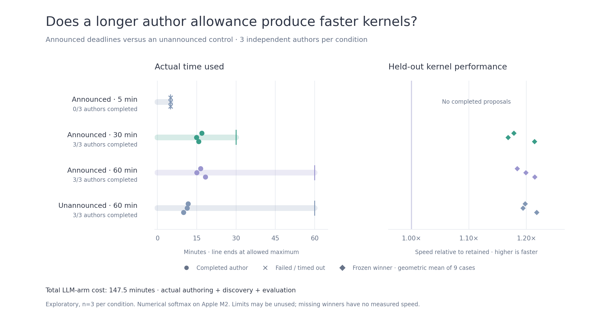

# Campaign 044: announced authoring deadlines

**Five minutes was insufficient; one hour did not consistently beat 30 minutes.**
Twelve independent `gpt-6-astra` / `xhigh` Codex CLI sessions compared announced
5-, 30- and 60-minute response allowances with an unannounced 60-minute control.
All nine completed authors produced valid kernels. The unannounced control used
less authoring time and produced similar performance on this workload.

These are numerical CPU softmax results on Apple M2, not exact MLX inference
gains. Three authors per condition provide exploratory evidence, not a general
relationship between reasoning time and performance. No candidate kernel was
promoted to a product default.



[SVG](assets/timers-044.svg) · [Compressed source evidence](assets/timers-044.json.gz) ·
[Frozen study harness and protocol](../experiments/timers_044/README.md)

## Results

The last column contains three separately selected winners, each measured over
all nine final cases in fresh paired replay against the retained winner. Ratios
above one mean faster execution; a missing response has no measured kernel speed.

| Allowance per author | Completed | Actual author time, runs 1 / 2 / 3 | Median author time | Speed versus retained, runs 1 / 2 / 3 |
| --- | --- | --- | --- | --- |
| Announced 5 minutes | 0/3 | 5:00 / 5:00 / 5:00, all timed out | — | Unmeasured |
| Announced 30 minutes | 3/3 | 16:56 / 14:56 / 15:44 | 15:44 | 1.1784× / 1.1680× / 1.2143× |
| Announced 60 minutes | 3/3 | 16:27 / 14:58 / 18:20 | 16:27 | 1.1842× / 1.1991× / 1.2145× |
| Unannounced 60 minutes | 3/3 | 11:41 / 11:20 / 9:58 | 11:20 | 1.1980× / 1.1943× / 1.2178× |

All **27 returned proposals compiled and passed all discovery and final numerical
checks without repairs**: 2,430 candidate/distribution checks, with no failures.
The sources were all distinct by exact hash. All nine selected LLM winners passed
both the frozen NumPy acceptance gate and the stricter incremental comparison
against retained: geometric-mean speedup at least 1.02× and every final case's
paired lower interval above 1×.

The retained controls passed NumPy acceptance in 12/12 runs, at 1.664–1.691×
NumPy. Enumeration passed in 3/12 runs and lost to retained in every paired
comparison, at 0.798–0.820× retained. LLM winners measured 1.957–2.076× NumPy.
These fixed control pools do not represent every possible non-LLM search.
The full discovery/evaluation search recorded 35,640 passing numerical checks,
including repeated reference checks; this is not that many independent workloads.

## Does the extra allowance help?

Direct comparisons replayed the already frozen LLM winners together, without
reselection. Pairing uses the independent authors' block indices, not continued
versions of the same author.

| Candidate / reference | Run 1 | Run 2 | Run 3 | Pairs with every case's lower interval >1× |
| --- | --- | --- | --- | --- |
| Announced 60 / announced 30 minutes | 1.0023× | 1.0283× | 0.9954× | 1/3 |
| Announced 60 / unannounced 60 minutes | 0.9926× | 1.0112× | 0.9991× | 0/3 |

The one-hour allowance won one comparison with 30 minutes by 2.8%, while the
other two had mixed per-case outcomes. It did not consistently outperform the
unannounced control. The timing intervals describe repeated measurements of
each particular kernel pair; they are not confidence intervals over possible
model authors. Lack of consistent superiority is not a proof of equivalence.

Announcing a deadline also did not make the five-minute authors finish in time.
The prompt described the maximum duration and the need to leave time for final
JSON, but authors received no clock readings or elapsed-time feedback. This tests
**deadline instructions**, not a reliable internal clock or enforced reasoning
allocation. Both longer announced conditions finished well before their caps.
They returned the requested three proposals; that does not establish that they
had exhausted useful ideas.

For this one-shot workload, 30 minutes provided enough headroom for every
completed author observed in this study. Keep the cap configurable; these data
do not justify a universal one-hour default. A sustained one-hour experiment
needs a different protocol: repeated proposal → measurement → revision, explicit
remaining-time feedback, matched evaluation budgets, checkpoints and untouched
final cases. Merely increasing this one-response timeout does not create that loop.

## Cost and payback

| Condition | Authoring + discovery/evaluation, all three runs | Reported input / output tokens | Reasoning tokens, included in output | Search-only break-even versus retained |
| --- | --- | --- | --- | --- |
| Announced 5 minutes | 15.00 min | Unknown | Unknown | No returned kernel |
| Announced 30 minutes | 48.32 min | 35,804 / 71,091 | 48,712 | 13.1 million–1.31 billion calls |
| Announced 60 minutes | 50.46 min | 35,800 / 74,310 | 51,109 | 13.8 million–1.64 billion calls |
| Unannounced 60 minutes | 33.71 min | 35,467 / 49,113 | 32,110 | 9.22 million–955 million calls |

Actual authoring totaled **145.34 minutes**; adding LLM-arm discovery/evaluation
gives **147.50 minutes**. The entire runner, including controls and additional
paired measurements, took **2 hours 34 minutes 22 seconds**, from
2026-10-03 19:58:33 to 22:32:55 UTC. The frozen maximum authoring allowance was
7 hours 45 minutes and was mostly unused.

Billing dollars are unknown. Token totals cover completed-turn receipts only;
the CLI returned none for the killed five-minute attempts. The archived original
summary sums available receipts to zero for that condition and labels this scope;
that zero must not be interpreted as zero consumption or zero cost. Provider
latency, prompt caching and generation throughput were not controlled, so elapsed
time is not a pure measurement of model reasoning compute.

Per-case payback uses each winner's actual authoring plus discovery/evaluation
cost, divided by its measured seconds saved per call against retained. Deployment
setup was not measured; `break_even_calls` remains null and
`search_only_break_even_calls` supplies these lower bounds. Study engineering,
control runs and extra scientific comparisons are excluded from that per-winner
cost. Results depend strongly on shape because an individual softmax call is short.

## What was frozen

- Same model, effort, hardware context, source interface, numerical contract,
  compiler flags and three proposal slots per author. No tools, repository/history
  access, browsing, measurement feedback, retries or repairs. Event receipts were
  checked for forbidden tool activity; none occurred in eligible responses.
- Sequential authoring in three seeded randomized blocks. The realized order put
  announced 30 minutes first and announced 5 minutes second in every block; this
  was not a fully counterbalanced design. Provider conditions and stopping
  behavior remain possible confounders.
- Six discovery cases: shapes 6×191 and 48×769, each in C, Fortran and sliced
  layouts. Nine fresh final cases: 9×197, 43×787 and 101×1553 in the same layouts.
  All twelve author attempts and every discovery selection completed before
  opening any final case across all four conditions.
- Buffered NumPy deployment comparator, fixed retained and enumerated controls,
  independent float64 numerical oracle and fixed validation distributions.
  Validation is finite and tolerance-based; it is not a bitwise or universal proof.
- Five screening and fifteen confirmation timing blocks, 0.5 ms target batches,
  single-thread settings and separate worker processes. Candidate and timing
  budgets were matched; total authoring wall time was deliberately not matched.

The environment was Apple M2 / arm64 macOS, Python 3.11.3, NumPy 1.26.4,
SciPy 1.16.0, Apple clang 21.0.0 and Codex CLI 0.159.0. Product source was
`487e0eae025e80e7c8a03efb6ba7b3aa7980855a`; the new study sources were hashed
before authoring. The evidence includes exact authored source, frozen prompts,
controls, contracts, source hashes, selections, timing samples, validation results
and usage receipts. Original file digests precede path redaction. Raw CLI streams,
temporary runtime/auth metadata and compiled binaries are excluded.

## Relationship to campaign 043

Campaign 043's five- and 30-minute prompts were identical: authors were **not told
their deadline**. Its three successful authors finished in 6:50, 10:08 and 7:21.
The earlier **25.0 minutes was the sum of authoring and search/evaluation across
three runs**, not one author working for 25 minutes. Current 044 final shapes are
different, so comparing the two campaigns' percentage gains does not isolate a
timer effect. The direct comparisons above use the same final cases.

## Reproduce and inspect

[Study instructions](../experiments/timers_044/README.md) provide the foreground
command with timestamped progress and a retained log. A fresh run can consume
the full 7¾-hour authoring allowance plus evaluation; it requires an authenticated
CLI exposing the selected model and flags. This is an experimental CLI harness,
not a packaged vendor-provider integration.

Regenerate the figure from the compressed evidence without making model calls
or running native benchmarks. Install the optional `matplotlib` plotting
dependency, then run from the repository root:

```sh
python lossless-product/scripts/plot_timer_study.py --evidence lossless-product/docs/assets/timers-044.json.gz --output lossless-product/docs/assets
```

The renderer checks receipt counts, numerical passes and all plotted speed ratios
against the archived raw confirmation samples. Each diamond is a nine-case
geometric mean; each circle is actual elapsed author time, and crosses are failed
attempts. The background line ends at the allowed maximum. No missing winner is
assigned a fictitious speed, and the chart does not imply that unused time produced
additional search.

The subsequent [one-hour iterative pilot, campaign 045](iterate-045.md), tested
that separate feedback loop. Its final kernel was only 1.00284× the first-round
choice on fresh paired cases, failing the incremental gate; three response
batches completed and a fourth timed out. It does not establish a benefit from
the extra revisions.
